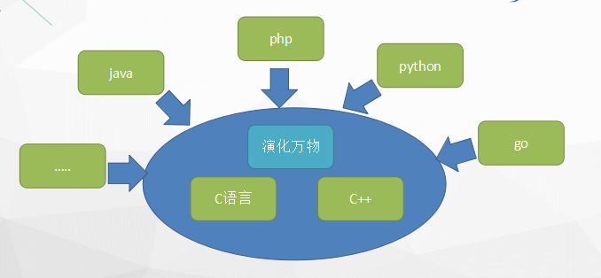
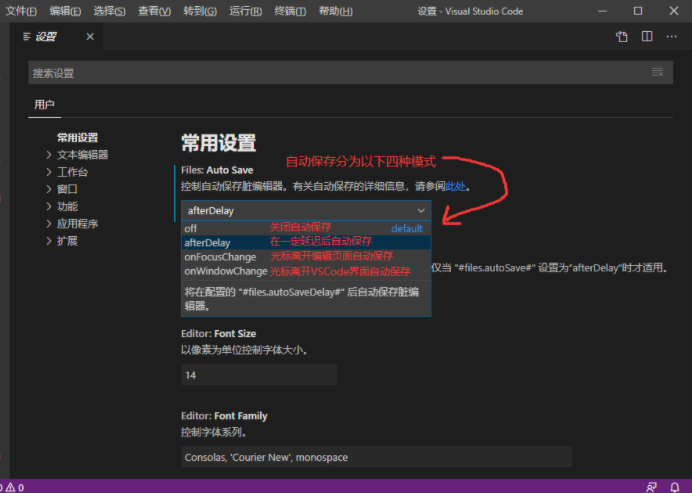
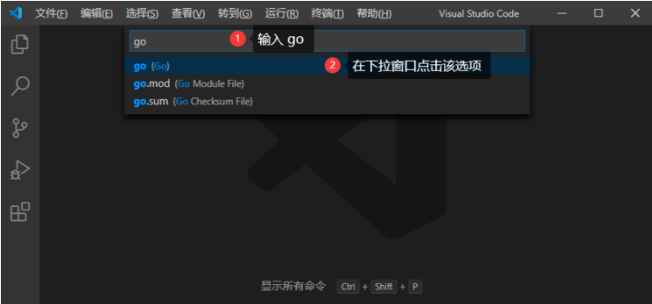

# go介绍与安装
## 1.go语言介绍
- 1946年，大家所熟知的第一台通用计算机埃尼阿克（ENIAC）问世

- 最先出生的编程语言是机器语言，它非常简单。有多简单呢？简单到只用“1”和“0”两个数字就可以进行编程

- 所以….最终当时编写是这样的内容

- 万一出现bug、少写一个零咋办、话说谁能告诉我这些01001是表达什么
- 汇编语言用助记符代替了机器语言中的操作码，用地址符号或标号代替了指令或操作数地址----- 20世纪50年代





- 为了解决内部问题,在2006年1月2日下午15点4份3秒一个语法简洁开发高效高性能的，又GO又lang的语言诞生


- 因为编译速度快,又不依赖与C/C++,就成为21世纪的C语言


### 1.1 优劣势对比
Go的优势
- 学习曲线容易：go语言语法简单简洁、有点类似C与C++的写法；只需要短短的时间即可上手并写出一个小项目
- 效率：具有快速的编译时间、开发效率和运行效率高
- 齐全的标准库：go的标准库基本都很稳定，并且包含互联网应用、系统编程和网络编程这些库
- 部署方便：二进制文件，ctrl c + v部署
- 简单的并发：简简单单的即可实现并发和异步编程 
- 稳定性：go具有强大的编译检查、严格的编码规范和完整的软件生命周期工具，具有很强的稳定性

Go的缺点
- 缺少明确主要框架：虽然有beego、echo、gin、lris等框架但是目前并没有一个主要的框架很多人任务可以不用框架即可开始实现功能需求，PHP有laravel，java spring系列，Python的django等
- 错误处理：go语言通过函数和预期的调用代码简单的返回错误而帮助开发者处理编译错误，但是容易丢失错误发生的范围，一些错误信息可能也需要自己定义
- 软件包管理：go语言虽然优秀尴尬的是，它没有办法制定特定版本的依赖库，而PHP、java、Python等都有很好的软件包管理系统
### 1.2 动静分离
动态语言：
````        
不需要直接指定变量类型，在解释的时候，转换为目标代码和运行程序一步到位，比如PHP、Python、Ruby、Perl。
````
静态语言：
````
变量的类型在编译之前就需要确定，在编译的时候需要先编译，将源码转换成目标代码，然后需要运行目标代码程序才能运行，比如go、C++、Java、Delphi、C#。
````
	
## 2.工具准备
编辑器
+ VSCode(这里选用)
+ GoLand （需要破解，可以自己尝试找破解方法） 
+ LiteIDE
+ Eclipse（需要安装go插件）
+ phpstrom（需要安装go插件）
### 2.1 VSCode使用
````
安装插件:

    - ms-ceintl.vscode-language-pack-zh-hans
    - rackar.markdown-image
    - telesoho.vscode-markdown-paste-image(这设置中修改图片的存储目录)
    - shd101wyy.markdown-preview-enhanced
    - golang.go(go语言提示包)
````
- Windows平台按下Ctrl+Shift+P，Mac平台按Command+Shift+P，这个时候VS Code界面会弹出一个输入框，如下图：


- 我们在这个输入框中输入>go:install，下面会自动搜索相关命令，我们选择Go:Install/Update Tools这个命令


- 选中并会回车执行该命令（或者使用鼠标点击该命令）
- 点击便器任意位置按下：ctrl+shift+p 键输入set，按下回车；进入系统设置界面


- 然后会弹出如下窗口，开始安装工具：


此时就可以使用了


打开设置页面就能看到自动保存相关配置如下图，可以根据自己的喜好选择自动保存的方式：


### 2.2 配置代码片段快捷键
- 还是按``Ctrl/Command+Shift+P``,按下图输入``>snippets``，选择命令并执行：


- 然后在弹出的窗口点击选择``go``选项:




````
“这里放个名字”:{
    "prefix": "这个是快捷键",
    "body": "这里是按快捷键插入的代码片段",
    "description": "这里放提示信息的描述"
}
````
其中``$0``表示最终光标提留的位置。 举个例子，我这里创建了两个快捷方式，一个是输入``pln``就会在编辑器中插入``fmt.Println()``代码；输入``plf``，就会插入``fmt.Printf("")``代码。
````
{
	"println":{
		"prefix": "pln",
		"body":"fmt.Println($0)",
		"description": "println"
	},
	"printf":{
		"prefix": "plf",
		"body": "fmt.Printf(\"$0\")",
		"description": "printf"
	}
}
````


## 3.安装go环境
### 3.1 windows下安装
- [官网下载安装包](https://golang.google.cn/dl/)
- 双击安装 go1.15.5.windows-amd64.msi

安装:


- 1. 我的电脑->属性->高级系统设置


- 2. 修改GOPATH为自定路径


检测:


### 3.1 Linux下安装
- 下载二进制包：go1.15.linux-amd64.tar.gz。
- 将下载的二进制包解压至 /usr/local目录。
````
tar -C /usr/local -xzf go1.15.linux-amd64.tar.gz
````
- 将 /usr/local/go/bin 目录添加至PATH环境变量：
````
export PATH=$PATH:/usr/local/go/bin
export GOROOT=/usr/local/go  //可以自行定义
````
检测
````
~ go version
go version go1.15.1 linux/amd64
````
## 4.简单的 hello world
````
package main

import "fmt"

func main() {
	// 定义一个字符串类型的hello 定义变量的方法有三种
	var hello string = "Hello World!"
	// 不指定数据类型 GO会自动选择数据类型(类似于python)
	// var hello = "Hello World!"
	// hello := "Hello World!"
	fmt.Println(hello)
	// 输出Print和Println两种 print不会自动换行println自动换行
}
````
