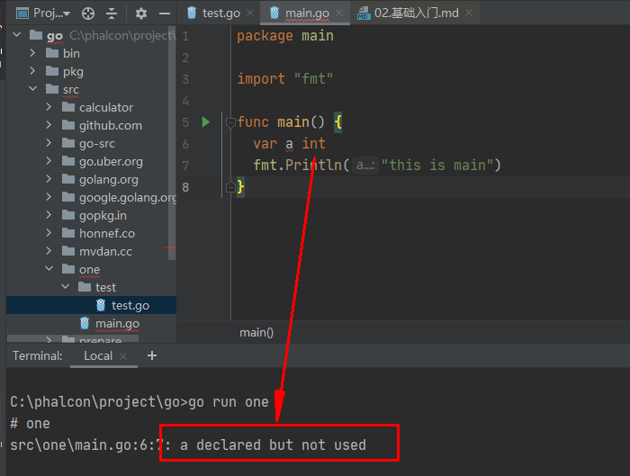

# 基础入门
## 1.项目目录
### 1.1 理解gopath
在进行Go语言开发的时候，我们的``代码``总是会保存在``$GOPATH/src``目录下。在工程经过``go build``、``go install``或``go get``等指令后，会将下载的第三方包源代码文件放在``$GOPATH/src``目录下， 产生的二进制可执行文件放在``$GOPATH/bin``目录下，生成的中间缓存文件会被保存在 ``$GOPATH/pkg`` 下
### 1.2 个人开发目录

### 1.3 团队开发目录


执行``go env``查看配置项信息

``GOPATH=C:\phalcon\project\go`` 这里是开发目录,我们在第一节中的全局变量中配置了

``set GOROOT=c:\go`` 这里是源码目录,安装是默认生成在该目录下

``执行 go build 项目名``生成的可执行文件默认生成在 C:\Users\Administrator 下,如果切换目录在那个目录下执行``go build 项目名``就在那个目录下生成可执行文件


执行``go install 项目名``生成的二进制文件会在``GOPATH=C:\phalcon\project\go\bin``目录下


## 2.Go语言特点
个人理解：然后语言均是会存在相似点共同点，也会存在不同点不同的场景运用
- 理解语言本身运行部署
- 掌握基础语法与其他语言的不同之处
- 实战案例运用
#### go 语言的思想 :``大道至简,小而蕴真``
### 2.1 执行``go run 目录名`` 慢的原因:
- 先找到项目目录文件
- 将 .go 文件编译成一个临时的可执行文件
- 运行结束后将临时文件删除掉

所以我们会先打包在使用,就是执行``go install 项目名``生成的二进制文件
### 2.2 简要说明go语言``新``的原因
- 自动立即回收
- 更丰富的内置类型
- 函数多返回值
- 错误处理
- 匿名函数和闭包
- 类型和接口
- 并发编程(协程很靠谱)
- 反射
- 语言交互性
#### 2.2.1 没有名命空间的概念
```go
//报名 不同于传统的命名空间(namespace)的概念
//只跟当前目录的名称有关,目录名称是什么,包名就是什么
package test
//引入组件
import "fmt"

//main是go语言特有的  就是传统一样上的入口 有且只有一个
func main()  {
	fmt.Println("this is one test")
}
````

```go
//------------------------------------C:\phalcon\project\go\src\one\main.go------------------------------------
package main

import (
	"one/test"
)

func main()  {
	//fmt.Print("this is test")
	test.Index()
}
//------------------------------------C:\phalcon\project\go\src\one\test\test.go------------------------------------
//包名 不同于传统的命名空间(namespace)的概念
//只跟当前目录的名称有关,目录名称是什么,包名就是什么
package test
//引入组件
import "fmt"

//main是go语言特有的  就是传统一样上的入口 有且只有一个
func Index()  {
	fmt.Println("this is one test")
}
````

#### 2.2.2 没有对象这种概念
传统的框架中都会有``class``类(面向对象),而``go``中则是以结构体为核心,类似于``C``语言
```go
type name struct {
  //其内只有属性没有方法 ,方法需要外部定义
}
````
#### 2.2.3 引入就要使用
在``go``中代码检查是非常严谨的



#### 2.2.4 可以有多个返回值
```go
package main

import "fmt"

func main() {
  a ,b := params()
  fmt.Println(a,b)
}

func params() (a int, b string) {
  return 1,"l love u"
}
//----------------------结果----------------------
//C:\phalcon\project\go>go run one
//  1 l love u
```
## 3.Go的关键词
````
break          default          func          interface     select

case           defer            go             map          struct

chan           else             goto           package      switch

const          fallthrough      if             range        type

continue        for             import          return      var

````
## 4.Go的保留字
````
常量:    true  false  iota  nil

类型:     int        int8      int16              int32          int64  
         uint       uint8      uint16            uint32          uint64    uintptr
         float32    float64    complex128        complex64
         bool       byte       rune              string          error

方法:    make        len        cap     new    append    copy    close    delete
        complex     real      imag
        panic       recover
````
## 5.Go语言定义
- #### 定义变量  ``var  变量名  变量类型``

全局变量:
```go
package main

import "fmt"

//定义全局变量
var arr int

func main() {
  arr = 1
  fmt.Println(arr) // 1
  //局部变量 但是一般不这样定义
  var arr string
  arr = "this is arr"
  fmt.Println(arr) //this is arr
}
````
局部变量:
```go
package main

import "fmt"

func main() {
  //局部变量 这样方式称为隐式声明
  arr := 1
  //第二次赋值用 =
  arr = 23
  brr := "this is brr"
  fmt.Println(arr,brr)
}
````
- #### 定义常量  ``const  常量名  =  常量值``
```go
package main

import "fmt"

const name = "will"
//批量赋值 量同理
const (
  age = 23
  sex = "man"
)

func main() {
  fmt.Println(name,age,sex)
}
````
- #### 定义类型   ``type    结构体名   (func / interface / struct)``
```go
package main

import "fmt"

//结构体接口
type hi interface {
  
}

//创建结构体
type info struct {
  //结构体的属性
  name string
  age int
}

func main() {
  //定义结构体
  info := info{
    name: "will",
    age: 23,
  }
  //调用结构体
  fmt.Println(info)
  fmt.Println(info.name)
}
````
- #### 定义方法&函数 ``func   函数名(){}  /   func (结构体)方法名(){}``
```go
package main

import "fmt"

type hi interface {

}

//定义结构体
type info struct {
  //结构体的属性
  name string
  age int
}

func (u info) tostring() {
  fmt.Println(u)
}
//int 定义返回值类型
func (u info) getAge() int  {
 return u.age
}

func main() {
  //创建结构体
  info := info{
    name: "will",
    age:  23,
  }
  //调用结构体
  fmt.Println(info.getAge()) //23
  info.tostring() //{will 23}
}
```
注意:
````
//我们称之为函数
func main() {
}

//我们称之为方法  方法是属于结构体的 根据结构体而定义的
func (u info) getAge() int  {
 return u.age
}
````
### 5.1 Go语言作用域
- 声明在函数内部，是函数的本地值，类似private
- 声明在函数外部，是对当前包可见(包内所有.go文件都可见)的全局值，类似protect
- #### 声明在函数外部且``首字母大写``是所有包可见的全局值,类似public
````
目录结构
- src 
    - one
        - test
            - all.go
            - test.go
        - main.go

------------------------test.go:------------------------
package test

import "fmt"

var a int

func index()  {
	fmt.Println("this is one test")
}

func hello()  {
	fmt.Println(1234)
}
------------------------all.go------------------------
package test

func All() {
	index()
	hello()
	println(a)
}
------------------------main.go------------------------
package main

import (
  "one/test"
)

func main() {
  test.All()
}
------------------------结果------------------------
this is one test
1234
0
````
### 5.2 Go语言运算符


## 6.GO中的包概念
````
包是结构化代码的一种方式：每个程序都由包（通常简称为 pkg）的概念组成，可以使用自身的包或者从其它包中导入内容。

如同其它一些编程语言中的类库或命名空间的概念，每个 Go 文件都属于且仅属于一个包。一个包可以由许多以 .go 为扩展名的源文件组成，因此文件名和包名一般来说都是不相同的。

你必须在源文件中非注释的第一行指明这个文件属于哪个包，如：package main。package main表示一个可独立执行的程序，每个 Go 应用程序都包含一个名为 main 的包
````


### 6.1 GO中的import 和 package
````
golang使胞package来管理定义模块,可以使用import关键字来导入使用。

如果导入的是go自带的包，则会去安装目录$GOROOT/src按包路径加载，如fmt包

如果是我们go get安装或自定义的包，则会去$GOPATH/src下加载
````
#### 下载第三方类库的方式``go get github.com/willyin/go-sms``
#### 使用第三方包
均是以 $GOPATH作为基础目录进行查找的
```go
package test

imports(
    "fmt"
    // 引入并起别名
    sms "github.com/willyin/go-sms" 
)

func main() {
    sms.SendEmail()
}
````
### 6.2 GO中的init与main
````
main函数只能用于main包中，且只能定义一个。如同PHP框架中的index.php

go语言中init函数用于包(package)的初始化，该函数是go语言的一个重要特性。可以理解为如同其他语言中的面向对象
````
多个包下的执行顺序(init 在 main方法之前执行)


- ``init``实际就是类似于构造函数,做一些初始化操作
- 由此可见``init``执行顺序和包的引入顺序有关,先引入先执行,后引入后执行
- 在一个文件中可以有多个``init``方法,而``main``只能有一个
````
1. init函数是用于程序执行前做包的初始化的函数，比如初始化包里的变量等
2. 每个包可以拥有多个init函数
3. 包的每个源文件也可以拥有多个init函数
4. 同一个包中多个init函数的执行顺序go语言没有明确的定义(说明)
5. 不同包的init函数按照包导入的依赖关系决定该初始化函数的执行顺序
6. init函数不能被其他函数调用，而是在main函数执行之前，自动被调用
````
## 7.常用命令
````
go env用于打印Go语言的环境信息。
go run命令可以编译并运行命令源码文件。
go get可以根据要求和实际情况从互联网上下载或更新指定的代码包及其依赖包，并对它们进行编译和安装。
go build命令用于编译我们指定的源码文件或代码包以及它们的依赖包。
go install用于编译并安装指定的代码包及它们的依赖包。
go clean命令会删除掉执行其它命令时产生的一些文件和目录。
go doc命令可以打印附于Go语言程序实体上的文档。我们可以通过把程序实体的标识符作为该命令的参数来达到查看其文档的目的。
go test命令用于对Go语言编写的程序进行测试。
go list命令的作用是列出指定的代码包的信息。
go fix会把指定代码包的所有Go语言源码文件中的旧版本代码修正为新版本的代码。
go vet是一个用于检查Go语言源码中静态错误的简单工具。
go tool pprof命令来交互式的访问概要文件的内
````


