#  [基础语法](https://studygolang.com/pkgdoc)
## 0.计算器的简单实现
````
目录结构

- bin
- pkg 
- src 
    - one
        - test
            - test.go
        - main.go
````
main.go
```go
package main

import (
  "fmt"
  "one/test"
)

func getInput() {
  var x int
  var y int
  var euma string
  fmt.Print("输入x: ")
  fmt.Scanf("%d\n", &x)

  fmt.Print("请输入 '+' '-' '*' '/' 符号: ")
  fmt.Scanf("%s\n", &euma)

  fmt.Print("输入y: ")
  fmt.Scanf("%d\n", &y)

  data := test.NewGetNum(x, y)
  switch euma {
  case "+":
    // fmt.Println("你输入的是", euma)
    fmt.Println("结果为：", data.Add(data))
  case "-":
    fmt.Println(data.Minus(data))
  case "*":
    data.Take(data)
  case "/":
    data.Division(data)
  }

}
func main() {
  for {
    getInput()
  }
}
````
test.go
```go
package test

// GetNum 获取输入数字
type GetNum struct {
	Target int
	Self   int
}

// NewGetNum 结构体初始化
func NewGetNum(a int, b int) *GetNum {
	return &GetNum{
		Target: a,
		Self:   b,
	}
}

// Add 加
func (s *GetNum) Add(new *GetNum) int {
	Sum := new.Target + new.Self
	return Sum
}

// Minus 减
func (s *GetNum) Minus(new *GetNum) int {
	Sum := new.Target - new.Self
	return Sum
}

// Take 乘法
func (s *GetNum) Take(new *GetNum) int {
	Sum := new.Target * new.Self
	return Sum
}

// Division 除法
func (s *GetNum) Division(new *GetNum) int {
	Sum := new.Target / new.Self
	return Sum
}
````
效果:

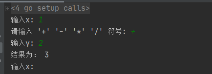
## 1.基础语法补充
### 1.1定义常量
- #### 基础声明方式
``const 常量名 = 常量值``
- #### 批量声明方式
```go
const (
    a = 'p',
    b = 'c'
)
````
- #### iota方式定义
```go
const ( 
    n1 = iota
)
````
区别于其他语言,实现一个简单的计数功能
```go
package main

import "fmt"

const (
  a = iota
  b 
  c = 100
  d
)

func main() {
  fmt.Println(a)
  fmt.Println(b)
  fmt.Println(c)
  fmt.Println(d)
}

//结果
// 0
// 1
// 100
// 100
````
```go
package main

import "fmt"

const (
  a = iota
  b = iota
  c = 100
  d = iota
)

func main() {
  fmt.Println(a)
  fmt.Println(b)
  fmt.Println(c)
  fmt.Println(d)
}

//结果
// 0
// 1
// 100
// 3
````
### 1.2 数据类型
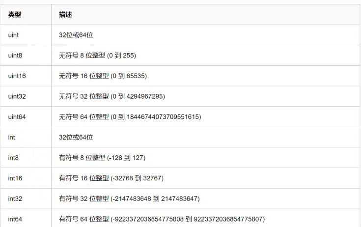

```go
package main

import "fmt"

// int8 -128~127
var a int8 = -128
var b int8 = 127
func main() {
  b := a - 1
  c := b + 1
  fmt.Println(b)
  fmt.Println(c)
}

//结果
// 127
// -128
````
当 ``var a int8 = 1`` 和 ``var b int = 1``相比较会报错
```go
package main

import "fmt"

// int8 -128~127
var a int8 = 127
var b int = 127
func main() {
  fmt.Println(a == b)
}
````
``.\main.go:9:17: invalid operation: a == b (mismatched types int8 and int)``
```go
package main

import "fmt"

// int8 -128~127
var a int8 = 127
var b int = 127
func main() {
  fmt.Println(a == int8(b))
}

//结果
//true
````
```go
package main

import "fmt"

// uint8 和 byte 互为别名
var a uint8 = 127
var b byte = 127
func main() {
  fmt.Println(a == b)
}

//结果
//true
````
### 1.3 字符串类型
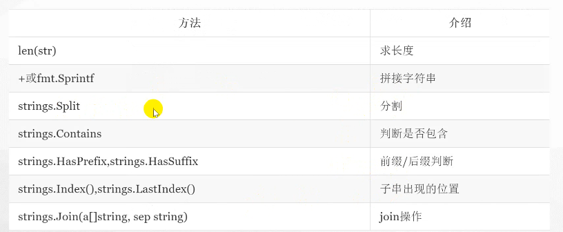

#### 数据类型强转
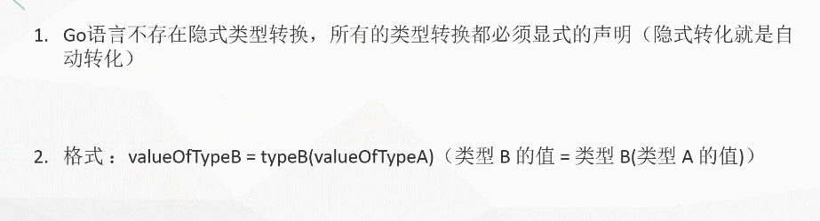

```go
package main

import (
  "fmt"
  "strconv"
)

func main() {
   a := "1" //假定从数据库中获取的字段
  //第二个参数表示进制数
  num1 , err := strconv.ParseInt(a, 10, 64)
  if err != nil {
    fmt.Println(err)
  }
  fmt.Println(num1 + 1)
}

// 结果
// 2
````
```go
package main

import (
  "fmt"
  "strconv"
)

func main() {
   a := "1" //假定从数据库中获取的字段
  //第二个参数表示进制数
  // - 代表省略
  num1 , _ := strconv.ParseInt(a, 10, 64)
  //if err != nil {
  //  fmt.Println(err)
  //}
  fmt.Println(num1 + 1)
}
````
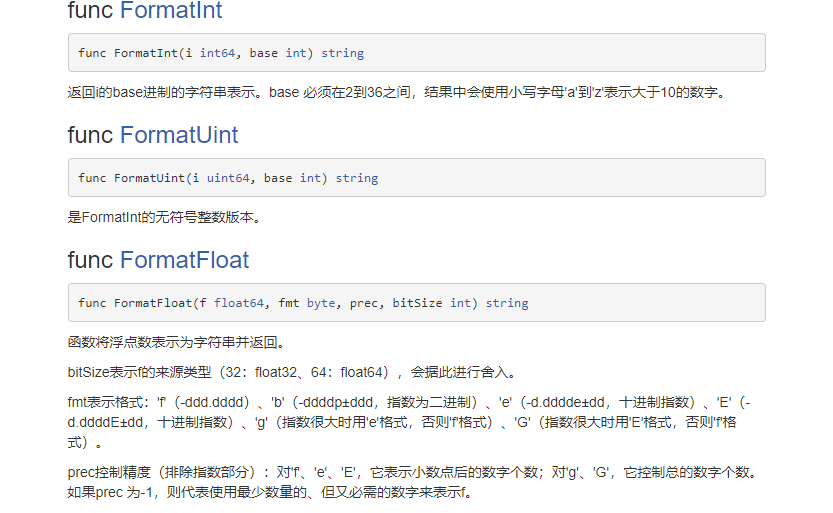
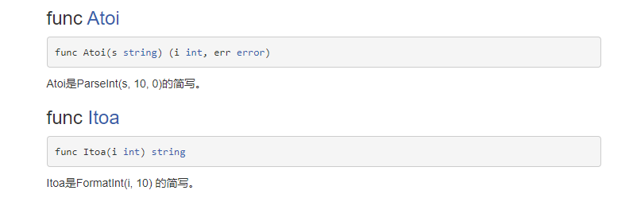

main.go
```go
package main

//_ 表示引用包下面的init初始化可以不调用其他方法
import (
  "fmt"
  _ "one/test"
  // "one/test"
)

func main() {
  fmt.Println("not use test")
  //getEcho()
}

//func getEcho()  {
//  test.Echo()
//}
````
test/test.go
```go
package test

import "fmt"

func init()  {
	fmt.Println("this is inti")
}

func Echo() {
	fmt.Println("this is echo")
}
````
## 2.指针与fmt输出与单元测试
### 2.1 fmt
fmt包： 实现了类似C语言printf和scanf的格式化I/O。主要分为向外输出内容和获取输入内容两大部分。
```go
func main(){
   fmt.println(“hello go lang”)
}
````
#### GO中的fmt-向外输出
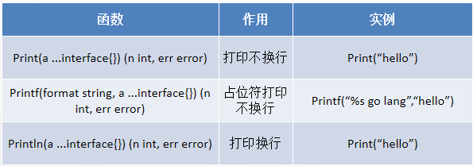
#### GO中的fmt-获取输入
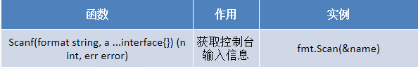
#### GO中的fmt-中printf占位符
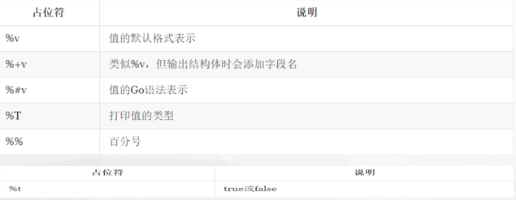
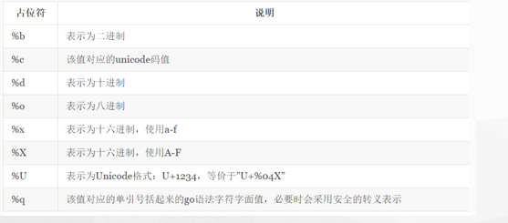
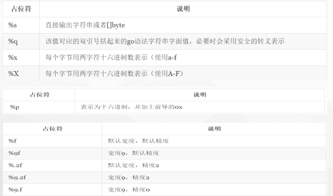
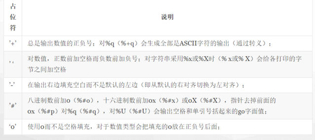

```go
package main

//_ 表示引用包下面的init初始化可以不调用其他方法
import (
  "fmt"
)

func main() {
  var a int8 = 127
  var b string = "string"
  fmt.Printf("(%d %s)",a,b)
}

// 结果
// (127 string)
````
### 2.2 GO中的指针
区别于C/C++中的指针，Go语言中的指针不能进行偏移和运算，是安全指针。
- ``&``  :   取地址
- ``*``   :   根据地址取值
```go
package main

import "fmt"

func main() {
  var b string = "string"
  //取址
  f := &b
  //取值
  *f = "p"
  fmt.Println(f)  //0xc00002e1f0
  fmt.Println(b)  //p
}
````
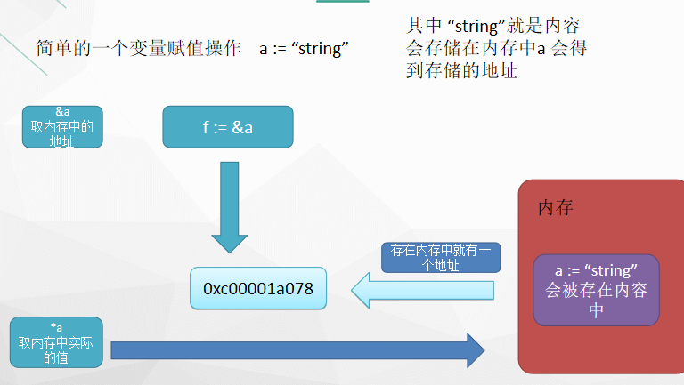

使用指针的好处是我们的参数值不需要重复定义,``a := kh``,这样会把``kh``的值和地址都会拷贝一份赋给``a``
```go
package main

import "fmt"

func main() {
  var b string = "string"
  //取址
  f := &b
  //取值
  *f = "p"
  fmt.Println(b)   //p
  fmt.Println(f)   //0xc00002e1f0
  fmt.Println(*f)  //p
  fmt.Println(&f)  //0xc0000c6018
}
````
### 2.3 注意空指针
当一个指针被定义后没有分配到任何变量时，它的值为 nil
```go
package main

import "fmt"

func main() {
  var p *string
  fmt.Println(p)
  fmt.Printf("p的值是%v\n", p)
}
````
## 3.单元测试
目录结构
````
src
    - one
        - unit
            - unit.go
            - unit_test.go

//一般测试文件都是以 文件_test.go 命名
````
unit.go
```go
package unit

import "strconv"

func getUserName(name string) string  {
	return "用户名为" + name
}
func getUserId(id int) int  {
	strconv.Itoa(id)
	return id
}
````
unit_test.go
```go
package unit

import "testing"

//这里 (t*testing.T) 是固定的写法 testing是一个测试的类
func TestGetUserName(t*testing.T)  {
	getUserName("will")
}
func TestGetUserId(t*testing.T)  {
	getUserId(1)
}
````
进入到 unit目录下 执行 ``go test`` , ``go test -v``是详细信息
## 4.基础语法
- #### if 
- #### switch 
- #### for
```go
package unit

import (
	"fmt"
	"testing"
)

func TestIf(t*testing.T)  {
	if k := 9; k < 10{
		fmt.Println("k",k)
	}
}
func TestSwitch(t*testing.T)  {
	data := 1
	//这里不需要手动break, 默认自行完成就自动跳出
	switch data {
	case 0:
		fmt.Printf("0")
		//加入这条命令默认不跳出循环可以继续向下执行
		fallthrough
	case 1:
		fmt.Printf("1")
	//支持一次性传递多个值
	case 2,3,4:
		fmt.Println("2 or 3 or 4")
	}


	//switch 另外一种风格 可以不传递值 相当于if 判断
	switch {
	case data >0:
		fmt.Println("this data is min")
	case data < 5:
		fmt.Println("this data is max")
	}
}
func TestFor(t*testing.T)  {
	//for 死循环的写法风格
	//for {
	//
	//}

	i := 9
	for  {
		fmt.Print(i)
		if i == 5 {
			break
		}
		i --
	}

	for i > 1 {
		fmt.Println(i)
		i --
	}
}
````
## 5.数组 与 map
### 5.1 数组
一维数组(定义)
````
var arr0 [5]int = [5]int{1, 2, 3}
var arr1 = [5]int{1, 2, 3, 4, 5}
var arr2 = [...]int{1, 2, 3, 4, 5, 6}
var str = [5]string{3: "hello world", 4: "tom"}
d := [...]struct {
    name string
    age  uint8
}{
    {"user1", 10}, // 可省略元素类 型。
    {"user2", 20}, // 别忘了最后一行的逗号。
}
````
```go
package main

import "fmt"

func main() {
  var arr1 [5]int = [5]int{1,2,3} // [1 2 3 0 0]
  var arr2 [5]int = [5]int{1,2,3,4,5} // [1 2 3 4 5]
  //动态传参
  var arr3 = [...]int{1,2,3,4,5} // [1 2 3 4 5]
  //定义字符串数组,这里索引值可以自己规定
  var str = [5]string{"a","b",3: "hello_world", 4: "tom"} //[a b  hello_world tom]
  fmt.Println(arr1,arr2,arr3,str)
}
````
多维数组(定义)
````
全局
var arr0 [5][3]int
var arr1 [2][3]int = [...][3]int{{1, 2, 3}, {7, 8, 9}}

局部：
a := [2][3]int{{1, 2, 3}, {4, 5, 6}}
b := [...][2]int{{1, 1}, {2, 2}, {3, 3}} // 第 2 纬度不能用 "..."。
````
数组存在的问题事不能进行动态的扩容,规定长度为多少就为多少

数组定义相关函数
- len   -- 来求长度，比如string、array、slice、map、channel ，返回长度
```go
package main

import "fmt"

func main() {
  var usernames [5]string = [5]string{"will", "yin"}
  fmt.Println(len(usernames)) // 5
}
````
### 5.2 切片
Go 数组的长度不可改变，在特定场景中这样的集合就不太适用，Go中提供了一种灵活，功能强悍的内置类型切片("动态数组"),与数组相比切片的长度是不固定的，可以追加元素，在追加时可能使切片的容量增大
#### 5.2.1 切片 特点
- 切片：切片是数组的一个引用，因此切片是引用类型。但自身是结构体，值拷贝传递。
- 切片的长度可以改变，因此，``切片是一个可变的数组``。
- 切片遍历方式和数组一样，可以用len()求长度。表示可用元素数量，读写操作不能超过该限制。 
- cap可以求出slice最大扩张容量，不能超出数组限制。0 <= len(slice) <= len(array)，其中array是slice引用的数组。
- 切片的定义：var 变量名 []类型，比如 var str []string  var arr []int。
- 如果 slice == nil，那么 len、cap 结果都等于 0。

定义切片
````
var identifier []type 为 nil
var slice1 []type = make([]type, len)  或  slice1 := make([]type, len)
arr1 := []int{0, 2}
````
```go
package main

import "fmt"

func main() {
  //定义切片,通过 append 向期内插入数值
  var arr1 []int = []int{1,2,3}
  arr1 = append(arr1, 4)
  fmt.Println(arr1)

  //这里 make 中的第二个参数为长度(元素个数不能大于数组的长度)
  arr2 := make([]int,1)
  arr2[0] = 1
  //arr2[1] = 2
  fmt.Println(arr2)
}
````
数组与切片操作

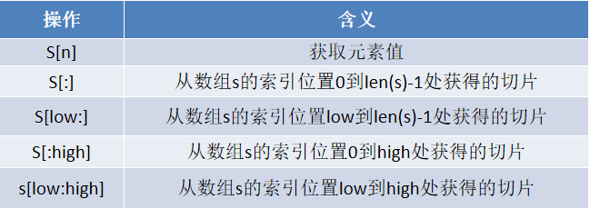
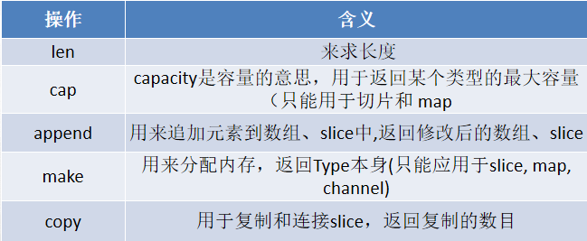

区别 cap和len
```go
package main

import "fmt"

func main() {
  // len 是计算容器的长度 cap 计算容器的容量
  arr2 := make([]int,5)
  arr2[0] = 1
  arr2[1] = 2
  arr2[2] = 3
  fmt.Println(len(arr2)) //5
  fmt.Println(cap(arr2)) //5
  arr2 = append(arr2,4)
  fmt.Println(len(arr2))//6
  fmt.Println(cap(arr2))//10
}
````
取出指定的某个值
```go
package main

import "fmt"

func main() {
  arr2 := make([]int,5)
  arr2[0] = 1
  arr2[1] = 2
  arr2[2] = 3
  //取一个范围内的值 arr[n:m]
  fmt.Println("arr2",arr2[0:2]) //[1 2]
  fmt.Println("arr2",arr2) //[1 2 3 0 0]
}

//注意如果是 arr2[3:3] 结果为 []
````
```go
package main

func main() {
  var arr1 [5]int = [5]int{0,1,2,3,4}
  //[n:] 会以元素的个数作为容量
  arr2 := arr1[4:]
  println(arr2) //[1/1]0xc000029f70
  println(cap(arr2)) //1
  println(len(arr2)) //1

  //这里[:n] 会以先天的容量作为自身的容量
  arr3 := arr1[:3]
  println(arr3) //[3/5]0xc000029f50
  println(cap(arr3)) //5
  println(len(arr3)) //3
}
````
Cap重新分配规律
````
 s := make([]int, 0, 1)
    c := cap(s)

    for i := 0; i < 50; i++ {
        s = append(s, i)
        if n := cap(s); n > c {
            fmt.Printf("cap: %d -> %d\n", c, n)
            c = n
        }
    }
````
### 5.3 Map集合
定义map集合
```go
package main

import "fmt"

func main() {
  //集合的缺点是不能改变数值的顺序
  maps := make(map[string]string,1)
  maps["name"] = "will"
  fmt.Println(maps) //map[name:will]

  //定义值的类型为切片类型
  //键为 string 值为 切片类型
  smap := make(map[string][]string,0)
  s := make([]string,0)
  s = append(s,"will","handsome")
  smap["value"] = s
  fmt.Println(smap) //map[value:[will handsome]]


  //定义键为切片 值为map
  will := make([]map[string]string, 2)
  //这里要声明集合才能使用
  map2 := make(map[string]string,0)
  map2["name"] = "will"
  map2["age"] = "100"
  map3 := make(map[string]string,0)
  map3["name"] = "bob"
  map3["age"] = "101"
  will[0] = map2
  will[1] = map3
  fmt.Println(will) //[map[age:100 name:will] map[age:101 name:bob]]

   //定义键为切片 值为map
    will1 := make([]map[string]string, 2)
    will1[0] = make(map[string]string, 2)
    will1[0]["name"] = "will"
    will1[0]["age"] = "23"
    fmt.Println(will1) //[map[age:23 name:will] map[]]
}
````