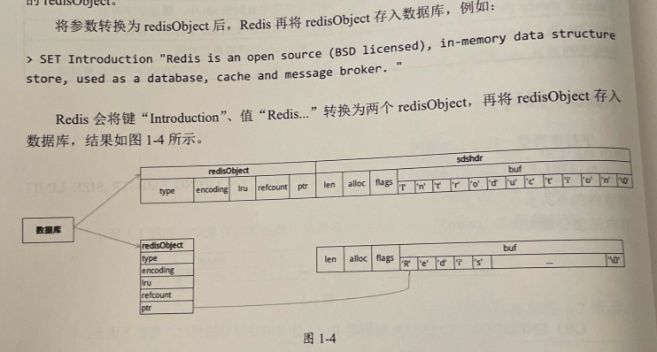

## String(sds/simple dynamic(动态) string)
以下代码全部存在于 `sds.h` 和 `sds.c` 中
```c
struct __attribute__ ((__packed__)) sdshdr5 {
    unsigned char flags; /* 3 lsb of type, and 5 msb of string length */
    char buf[];
};
struct __attribute__ ((__packed__)) sdshdr8 {
    uint8_t len; /* used */
    uint8_t alloc; /* excluding the header and null terminator */
    unsigned char flags; /* 3 lsb of type, 5 unused bits */
    char buf[];
}
```
Redis 还定义了sdshdrl6、sdshdr32、sdshdr64结构体。为了版面整洁，这里不展示sdshdr16、sdshdr32、sdshdr64结构体的代码，
它们与sdshdr8结构体基本相同，只是len、alloc属性使用了uintl6t、uint32、uint64t类型。Redis 定义不同sdshdr结构体是为了针对不同长度的字符串，
使用合适的len、alloc属性类型，最大限度地节省内存。

- len：已使用字节长度，即字符串长度。sdshdr5可存放的字符串长度小于32（2^5），sdshdrs8可存放的字符串长度小于256（2^8），以此类推。由于该属性记录了字符串长度，
  所以出可以在常数时间内获取字符串长度.Redis限制了字符串的最大长度不能超过512MB.
- alloc(分配)：已申请字节长度，即sds总长度。alloc-len为sds中的可用（空闲）空间。
- flag：低3位代表出r的类型，高5位只在sh5中使用，表示字符串的长度，所学山加点产受有回属性，另外，由于R小对5的定义是常最字待串，不支格扩容，所以不存在alloc属性。
- buf：字符作为buf的结尾，并且不计入 len.alloc 属性

## 构建函数
```c
// init initlen 字符串的内容和长度
sds _sdsnewlen(const void *init, size_t initlen, int trymalloc) {
    void *sh;
    sds s;
    
    char type = sdsReqType(initlen);  // 判断 sdshdr 类型

    if (type == SDS_TYPE_5 && initlen == 0) type = SDS_TYPE_8; // 长度为 0 的后续普遍需要扩容, 所以使用 SDS_TYPE_8 类型
    
    // sdsHdrSize 查询 结构体 sdshdr 的长度, s_malloc_usable 负责申请内存
    // 申请内存大小为 hdrlen+initlen+1, hdrlen 结构体长度, initlen 为字符串长度, 1 用于结尾的 "\0" 空格符放置
    int hdrlen = sdsHdrSize(type);
    unsigned char *fp; 
    size_t usable;
    assert(initlen + hdrlen + 1 > initlen); 
    sh = trymalloc?
        s_trymalloc_usable(hdrlen+initlen+1, &usable) :
        s_malloc_usable(hdrlen+initlen+1, &usable);
        
    // .... sds 实质就是 char* 的别名        

    s = (char*)sh+hdrlen;
    fp = ((unsigned char*)s)-1;
    usable = usable-hdrlen-1;
    if (usable > sdsTypeMaxSize(type))
        usable = sdsTypeMaxSize(type);
    switch(type) {
        case SDS_TYPE_5: {
            *fp = type | (initlen << SDS_TYPE_BITS);
            break;
        }
        case SDS_TYPE_8: {
            SDS_HDR_VAR(8,s);
            sh->len = initlen;
            sh->alloc = usable;
            *fp = type;
            break;
        }
        // ...... 内容 SDS_TYPE_8 一致
    }
    if (initlen && init)
        memcpy(s, init, initlen);
    s[initlen] = '\0';
    return s;
}
````


### 扩容机制
```c
sds _sdsMakeRoomFor(sds s, size_t addlen, int greedy) {
    void *sh, *newsh;
    
    // 获取当前的可用空间, 如果可用直接返回
    size_t avail = sdsavail(s);
    size_t len, newlen, reqlen;
    char type, oldtype = s[-1] & SDS_TYPE_MASK;
    int hdrlen;
    size_t usable;
    if (avail >= addlen) return s;

    len = sdslen(s); // 获取字符串的长度, sdshdr 结构体中记录了这个值, 所以时间复杂度为 O(1)
    
    
    sh = (char*)s-sdsHdrSize(oldtype);
    reqlen = newlen = (len+addlen);
    assert(newlen > len);  
     
    // 预分配比参数要求多的内存空间，避免每次扩容都要进行内存拷贝操作。新sds长度如果小于SDS_MAXPREALLOC（认为1024*1024，单位为字节），
    // 则新sds如长度自动扩答为2倍。否则，新sds长度自动增加SDS_MAX_PREALLOC 
    // 1Byte(B)字节 = 1 bit(b)位, 1KB = 1024B
    if (greedy == 1) {
        if (newlen < SDS_MAX_PREALLOC) // 1M大小
            newlen *= 2;
        else
            newlen += SDS_MAX_PREALLOC;
    }

    
    type = sdsReqType(newlen); // 负责计算 sdshdr 长度, 扩容后不使用 sdshdr5 这种类型不支持扩容
    if (type == SDS_TYPE_5) type = SDS_TYPE_8;

    // 如果扩容后还是同一个类型, 则继续使用 s_realloc 申请内存
    // 否则移动整个sds, 直接分配新的内存空间, 并将原来的字符串拷贝过来, 
    hdrlen = sdsHdrSize(type);
    assert(hdrlen + newlen + 1 > reqlen);  
    if (oldtype==type) {
        newsh = s_realloc_usable(sh, hdrlen+newlen+1, &usable);
        if (newsh == NULL) return NULL;
        s = (char*)newsh+hdrlen;
    } else {
        newsh = s_malloc_usable(hdrlen+newlen+1, &usable);
        if (newsh == NULL) return NULL;
        memcpy((char*)newsh+hdrlen, s, len+1);
        s_free(sh);
        s = (char*)newsh+hdrlen;
        s[-1] = type;
        sdssetlen(s, len);
    }
    usable = usable-hdrlen-1;
    if (usable > sdsTypeMaxSize(type))
        usable = sdsTypeMaxSize(type);
        
    // 更新sdshdr属性    
    sdssetalloc(s, usable);
    return s;
}
```


### 编码
字符串一共有3种类型, `OBJ_ENCODNG_RAW`、`OBJ_ENCODING_EMBSTR`、`OBJ_ENCODING_INT`
#### OBJ_ENCODING_EMBSTR(< 44字节)
针对短字符的优化,其优点有
- 内存申请和释放只需要一次函数操作
- redisObject, sdshdr 结构保存在一块连续的内存中, 减少内存碎片
````
---------------------------------------------------
       redisObject            |    sdshdr
---------------------------------------------------
type|encoding|lru|refcount|ptr|len|alloc|flags|buf
---------------------------------------------------
````
#### OBJ_ENCODNG_RAW(> 44字节)
在编译中, redisObject, sdshdr 结构存放在两个不连续的内存快中
#### OBJ_ENCODING_INT
将数值型字符串转换为整型，可以大幅降低数据占用的内存空间，如字符串“123456789012”需要占用12字节，
在Redis中，会将它转化为`long long`类型，只占用8字节


### 数据对象类型:
````
127.0.0.1:6379[1]> set name will
OK
127.0.0.1:6379[1]> type name
string
127.0.0.1:6379[1]> object encoding name
"embstr"


127.0.0.1:6379[1]> set intro  "Reais is an open source(Bs0 licensed), in-memory data structure store, used as a database, cache and message broker"
OK
127.0.0.1:6379[1]> type intro
string
127.0.0.1:6379[1]> OBJECT encoding intro
"raw"


127.0.0.1:6379[1]> set page 1
OK
127.0.0.1:6379[1]> type page
string
127.0.0.1:6379[1]> OBJECT encoding page
"int"
````
### 总结:
- Redis中的所有键和值都是redisObject变量。
- sds是Redis定义的字符串类型，支持二进制安全、扩容。
- sds可以在常数时间内获取学符串长度，并使用预分配内存机制减少内存拷贝次数。
- Redis对据编码的主要目的是最大用度地特省内存。字符非类型可以使用OBJ_ENCODNG_RAW、OBJ_ENCODING_EMBSTR、OBJ_ENCODING_INT编码格式。