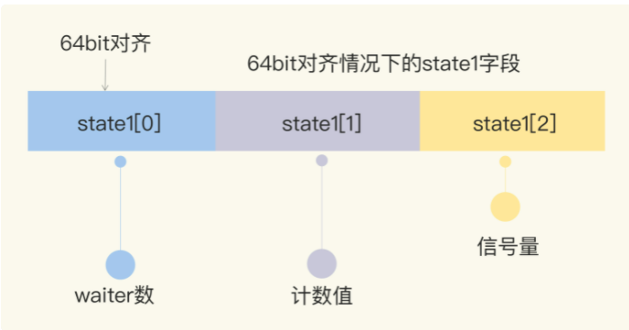
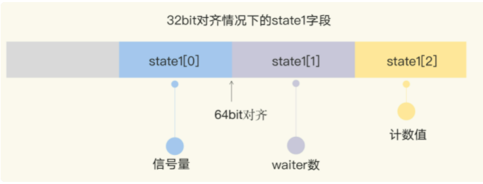

## WaitGroup
````
package waitGroup

import "sync"
/*
// 使用 unsafe.SizeOf(变量) // 查看对应类型占用的字节数
var arr [2]uint32
fmt.Println("arr的字节数为", unsafe.Sizeof(&arr)) // 8个字节, 64bit

// 对齐系数
func main()  {
 fmt.Printf("string alignof is %d\\n", unsafe.Alignof(string("a")))
 fmt.Printf("complex128 alignof is %d\\n", unsafe.Alignof(complex128(0)))
 fmt.Printf("int alignof is %d\\n", unsafe.Alignof(int(0)))
}

// 运行结果
// string alignof is 8
// complex128 alignof is 8
// int alignof is

注意：不同硬件平台占用的大小和对齐值都可能是不一样的
*/

----------------------------------------------------------------------------
var state1 [3]uint32

state1[0] = 11
state1[1] = 12
state1[2] = 3
fmt.Println(unsafe.Pointer(&state1)) // 0xc00000a0b0
fmt.Println((*uint32)(unsafe.Pointer(&state1))) // 0xc00000a0b0
fmt.Println(uintptr(unsafe.Pointer(&state1))%8) // 0
fmt.Println(atomic.LoadUint32((*uint32)(unsafe.Pointer(&state1)))) // 11
fmt.Println(int32(atomic.LoadUint64((*uint64)(unsafe.Pointer(&state1))) >> 32)) // 12
----------------------------------------------------------------------------	
type WaitGroup struct {
	// 辅助字段,辅助vet工具检测是否通过copy赋值这个WaitGroup实例
	noCopy noCopy
	// state1,一个复合意义的字段,包含 WaitGroup 计数/阻塞在检查点的waiter数/信号量
	state1 [3]uint32
}

// 得到state的地址和信号量的地址
func (wg *WaitGroup) state() (statep *uint64, semap *uint32) {
	if uintptr(unsafe.Pointer(&wg.state1))%8 == 0 {
		// 如果地址是64bit对齐的,数据前两个元素做state, 最后一个做信号量
		return (*uint64)(unsafe.Pointer(&wg.state1)), &wg.state1[2]
	} else {
		// 如果地址是32bit对齐的,数组后两个做state, 第一个做信号量
		return (*uint64)(unsafe.Pointer(&wg.state1[1])), &wg.state1[0]
	}
}
````
#### 64位环境:


#### 32位环境:


### Add 方法的逻辑
Add 方法主要操作的是state的计数部分, 可以自己增加一个delta值,内部通过原子操作把这个值增加到计数值上, 这个delta可以是个负数,相当于计数值减一
Done方法的内部就是通过Add(-1)实现的
```go
func (wg *WaitGroup) Done() {
	wg.Add(-1)
}

func (wg *WaitGroup) Add(delta int) {
statep, semap := wg.state()

// ......

state := atomic.AddUint64(statep, uint64(delta)<<32)
v := int32(state >> 32) // 当前计数值
w := uint32(state) // waiter count
if race.Enabled && delta > 0 && v == int32(delta) {

if v > 0 || w == 0 {
return
}

// 如果计数值 v 为 0 并且waiter的数量 w 不为 0, 那么 state 的值就是waiter的数量
// 将waiter的数量设置为0, 因为计数值v也是0, 所以它们俩的组合*statep直接设置为0即可
*statep = 0
for ; w != 0; w-- {
runtime_Semrelease(semap, false, 0)
}
````
### Wait 方法的逻辑
Wait方法的实现逻辑是,不断检查state的值,如果其中的计数值变为了0,说明所有的任务完成,调用者不必等待,直接返回
如果大于0,还有任务没有完成,调用者变成了等待者,需要加入waiter队列,并且阻塞住自己
```go
func (wg *WaitGroup) Wait() {
	statep, semap := wg.state()

	for {
		state := atomic.LoadUint64(statep)
		v := int32(state >> 32) // 当前的计数值
		w := uint32(state) // waiter的数量
		if v == 0 {
			// Counter is 0, no need to wait. 继续执行它后面的逻辑
			if race.Enabled {
				race.Enable()
				race.Acquire(unsafe.Pointer(wg))
			}
			return
		}
		// 否则把wait数量+1,期间可能有并发调用Wait的情况,所以最外层使用一个for循环
		if atomic.CompareAndSwapUint64(statep, state, state+1) {
			if race.Enabled && w == 0 {
				race.Write(unsafe.Pointer(semap))
			}
			runtime_Semacquire(semap)
			if *statep != 0 {
				panic("sync: WaitGroup is reused before previous Wait has returned")
			}
			if race.Enabled {
				race.Enable()
				race.Acquire(unsafe.Pointer(wg))
			}
			return
		}
	}
}
````
### 常见的WaitGroup的错误
#### 计数器设置为负值
出现有两种情况:
- 调用Add的时候传递一个负数
```go
func main() {
    var wg sync.WaitGroup
    wg.Add(10)
    wg.Add(-10)
    wg.Add(-1)
}
````
- 调用done的次数过多,超过了WaitGroup的计数值
```go
func main() {
    var wg sync.WaitGroup
    wg.Add(1)
    wg.Done()
    wg.Done()
}
````
#### 不期望的 Add 时机
等所有的Add方法调用后再调用Wait
```go
func main() {
    var wg sync.WaitGroup
    go doSomething(100, &wg)
    go doSomething(100, &wg)
    go doSomething(100, &wg)
    
    wg.Wait()
    fmt.Println("Done")
}

func doSomething(wg *sync.WaitGroup) {
    time.Sleep(time.Second)
    wg.Add(1)
    fmt.Println("后台执行")
    wg.Done()
}
````
解决方法:
```go
func main() {
    var wg sync.WaitGroup
    wg.Add(3)
    go doSomething(100, &wg)
    go doSomething(100, &wg)
    go doSomething(100, &wg)
    
    wg.Wait()
    fmt.Println("Done")
}

func doSomething(wg *sync.WaitGroup) {
    time.Sleep(time.Second)
    fmt.Println("后台执行")
    wg.Done()
}
````
或者:
```go
func main() {
    var wg sync.WaitGroup
    doSomething(100, &wg)
    doSomething(100, &wg)
    doSomething(100, &wg)
    
    wg.Wait()
    fmt.Println("Done")
}

func doSomething(wg *sync.WaitGroup) {
    wg.Add(1)
    go func() {
        time.Sleep(time.Second)
        fmt.Println("后台执行")
        wg.Done() 	
    }()
}
````
#### 前一个Wait未结束就重用 WaitGroup 
WaitGroup本质上是可以重用的, 但是需要等到它的计数恢复到0, 此时才可以被看作为新创建的WaitGroup, 被重复使用
```go
func main() {
    var wg sync.WaitGroup
    wg.Add(1)
    go func() {
        time.Sleep(time.Millisecond)
        wg.Done()
        wg.Add(1)
    }()
    wg.Wait() // 主 goroutine 等待, 有可能和第7行并发执行
}
````
### 关于 noCopy, 辅助 vet 检查
它的类型是noCopy
```go
type noCopy struct{}

func (*noCopy) Lock()   {}
func (*noCopy) Unlock() {}
````
如果想要自定一个结构体不被复制使用,或者说通过vet工具检测出复制使用就报警,可以通过嵌入 noCopy 来实现此功能