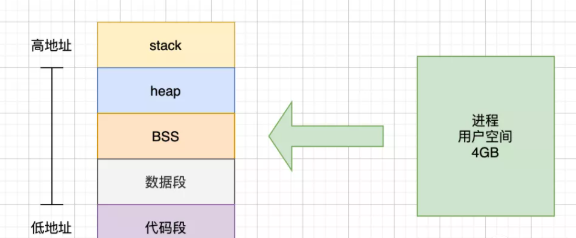
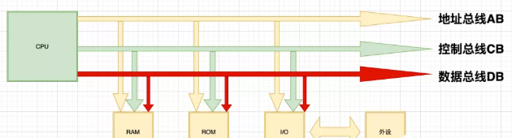
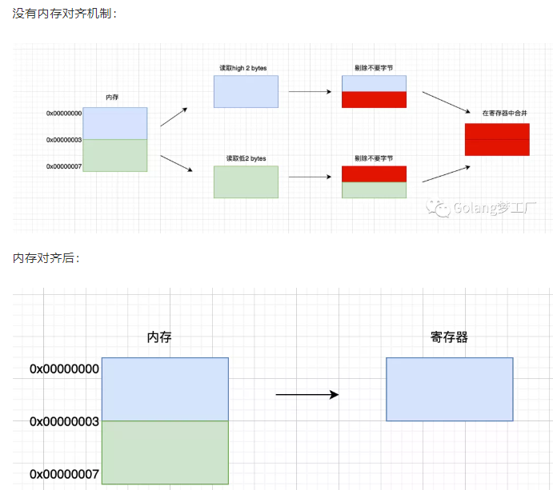
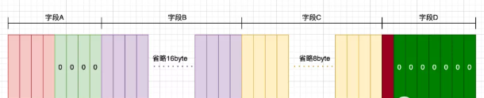
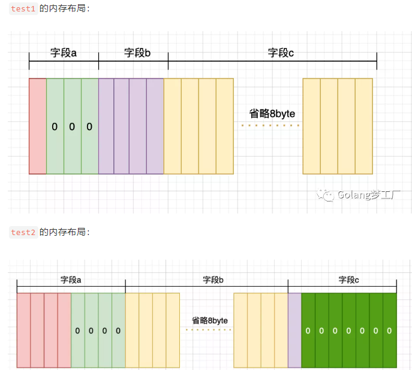

## 详解内存对齐
- ### 内存管理
我们都知道内存是计算中重要的组成之一，内存是与CPU进行沟通的桥梁，用于暂存CPU中的运算数据、以及与硬盘等外部存储器交换的数据。
早期，程序是直接运行在物理内存上的，直接操作物理内存，但是会存在一些问题，比如使用效率低、地址空间不隔离等问题，所以就出现了虚拟内存，
虚拟内存就是在程序和物理内存之间引入了一个中间层，这个中间层就是虚拟内存，这样就达到了对进程地址和物理地址的隔离。在linux系统中，
将虚拟内存划分为用户空间和内核空间，用户进程只能访问用户空间的虚拟地址，只有通过系统调用、外设中断或异常才能访问内核空间，
我们主要来看一下用户空间，用户空间被分为5个不同内存区域



- 代码段：存放可执行文件的操作指令，只读
- 数据段：用来存放可执行文件中已初始化全局变量，存放静态变量和全局变量
- BSS段：用来存未初始化的全局变量
- 栈区(stack)：用来存临时创建的局部变量
- 堆区(heap)：用来存动态分配的内存段

CPU: 
> 中央处理单元（Cntral Pocessing Unit）的缩写，也叫处理器；CPU是计算机的运算核心和控制核心，我们人类靠着大脑思考，
> 电脑就是靠着CPU来运算、控制，起到协调和控制作用，从功能来看，CPU 的内部由寄存器、控制器、运算器和时钟四部分组成，各部分之间通过电信号连通

CPU和内存的工作关系:
> 当我们执行一个程序时，首先由输入设备向CPU发出操作指令，CPU接收到操作指令后，硬盘中对应的程序就会被直接加载到内存中，此后，CPU 再对内存进行寻址操作，
> 将加载到内存中的指令翻译出来，而后发送操作信号给操作控制器，实现程序的运行或数据的处理。存在于内存中的目的就是为了CPU能够过总线进行寻址，
> 取指令、译码、执行取数据，内存与寄存器交互，然后CPU运算，再输出数据至内存



OS：
> os全称为Operating System，也就是操作操作系统，是一组主管并控制计算机操作、运用和运行硬件、软件资源和提供公共服务组织用户交互的相互关联的系统软件，
> 同时也是计算机系统的内核与基石。

编译器：
> 编译器就是将“一种语言（通常为高级语言）”翻译为“另一种语言（通常为低级语言）”的程序。
> 一个现代编译器的主要工作流程：源代码 (source code) → 预处理器(preprocessor) → 编译器 (compiler) → 目标代码 (object code) → 链接器 (Linker) → 可执行程序(executables)。

#### 小结:
> 计算机中，最小的存储单元为字节，理论上任意地址都可以通过总线进行访问，每次寻址能传输的数据大小就跟CPU位数有关。常见的CPU位数有8位，16位，32位，64位。
> 位数越高，单次操作执行的数据量越大，性能也就越强。os的位数一般与CPU的位数相匹配，32位CPU可以寻址4GB内存空间，也可以运行32位的os，
> 同样道理，64位的CPU可以运行32位的os，也可以运行64位的os。
### 什么是内存对齐
> 现代计算机中内存空间都是按照字节(byte)进行划分的，所以从理论上讲对于任何类型的变量访问都可以从任意地址开始，但是在实际情况中，在访问特定类型变量的时候经常在特定的内存地址访问，
> 所以这就需要把各种类型数据按照一定的规则在空间上排列，而不是按照顺序一个接一个的排放，这种就称为内存对齐，内存对齐是指首地址对齐，而不是说每个变量大小对齐。
### 为何要有内存对齐
主要原因可以归结为两点：

- 有些CPU可以访问任意地址上的任意数据，而有些CPU只能在特定地址访问数据，因此不同硬件平台具有差异性，这样的代码就不具有移植性，如果在编译时，
  将分配的内存进行对齐，这就具有平台可以移植性了
  
- CPU每次寻址都是要消费时间的，并且CPU 访问内存时，并不是逐个字节访问，而是以字长（word size）为单位访问，所以数据结构应该尽可能地在自然边界上对齐，
  如果访问未对齐的内存，处理器需要做两次内存访问，而对齐的内存访问仅需要一次访问，内存对齐后可以提升性能
  
举例:
````
假设当前CPU是32位的，并且没有内存对齐机制，数据可以任意存放，现在有一个int32变量占4byte，存放地址在0x00000002 - 0x00000005(纯假设地址，莫当真)，
这种情况下，每次取4字节的CPU第一次取到[0x00000000 - 0x00000003]，只得到变量1/2的数据，所以还需要取第二次，为了得到一个int32类型的变量，
需要访问两次内存并做拼接处理，影响性能。如果有内存对齐了，int32类型数据就会按照对齐规则在内存中，上面这个例子就会存在地址0x00000000处开始，
那么处理器在取数据时一次性就能将数据读出来了，而且不需要做额外的操作，使用空间换时间，提高了效率。
````


### 对齐系数
每个特定平台上的编译器都有自己的默认"对齐系数"，常用平台默认对齐系数如下：

- 32位系统对齐系数是 4
- 64位系统对齐系数是 8

````
C语言中，可以通过预编译指令#pragma pack(n)来修改对齐系数，因为C语言是预处理器的，但是在Go语言中没有预处理器，
只能通过tags和命名约定来让Go的包可以管理不同平台的代码，

既然对齐系数无法更改，但是我们可以查看对齐系数,使用Go语言中的unsafe.Alignof可以返回相应类型的对齐系数,对齐系数都符合2^n这个规律，最大也不会超过8。
````
demo
```go
func main()  {
 fmt.Printf("string alignof is %d\n", unsafe.Alignof(string("a")))
 fmt.Printf("complex128 alignof is %d\n", unsafe.Alignof(complex128(0)))
 fmt.Printf("int alignof is %d\n", unsafe.Alignof(int(0)))
}

// 运行结果
// string alignof is 8
// complex128 alignof is 8
// int alignof is 
````
注意：不同硬件平台占用的大小和对齐值都可能是不一样的。
### 结构体的内存对齐规则
一提到内存对齐，我们都喜欢拿结构体的内存对齐来举例子, 其实其他类型也都是要内存对齐的, 只不过拿结构体来举例子能更好的理解内存对齐，并且结构体中的成员变量对齐有自己的规则，我们需要搞清这个对齐规则

C语言的对齐规则与Go语言一样，所以C语言的对齐规则对Go同样适用：

#### 规则:
- 对于结构体的各个成员，第一个成员位于偏移为0的位置，结构体第一个成员的偏移量(offset)为0，以后每个成员相对于结构体首地址的offset都是该成员大小与有效对齐值中较小那个的整数倍，
  如有需要编译器会在成员之间加上填充字节。
  
- 除了结构成员需要对齐，结构本身也需要对齐，结构的长度必须是编译器默认的对齐长度和成员中最长类型中最小的数据大小的倍数对齐。

```go
func main() {
    // unsafe.Alignof 返回对齐值(对齐系数)
	fmt.Println(unsafe.Alignof([]int32{1, 2, 3})) // 8
	// unsafe.Sizeof 返回占用内存大小
	fmt.Println(unsafe.Sizeof([]int32{1, 2, 3})) // 24
}
````
```go
// 64位平台，对齐参数是8
type User struct {
 A int32 // 4
 B []int32 // 24
 C string // 16
 D bool // 1
}

func main()  {
 var u User
 fmt.Println("u1 size is ",unsafe.Sizeof(u))
}
// 运行结果
// u size is  56 
````
这里我的mac是64位的，对齐参数是8，

int32、[]int32、string、bool对齐值分别是4、8、8、1，
占用内存大小分别是4、24、16、1，

#### 我们先根据第一条对齐规则分析User
- 第一个字段类型是int32，对齐值是4，大小为4，所以放在内存布局中的第一位.
- 第二个字段类型是[]int32，对齐值是8，大小为24，按照第一条规则，偏移量应该是成员大小24与对齐值8中较小那个的整数倍，那么偏移量就是8，所以4-7位会由编译进行填充，
  一般为0值，也称为空洞，第9到32位为第二个字段B.
- 第三个字段类型是string，对齐值是8，大小为16，所以他的内存偏移值必须是8的倍数，因为user前两个字段就已经排到了第32位，所以offset为32正好是8的倍数，
  不要填充，从32位到48位是第三个字段C.
- 第四个字段类型是bool，对齐值是1，大小为1，所以他的内存偏移值必须是1的倍数，因为user前两个字段就已经排到了第48位，所以下一位的偏移量正好是48，
  正好是字段D的对齐值的倍数，不用填充，可以直接排列到第四个字段，也就是从48到第49位是第三个字段D
 
#### 根据第一条规则分析后，现在结构所占大小为49字节，我们再来根据第二条规则分析： 
- 根据第二条规则，默认对齐值是8，字段中最大类型程度是24，所以求出结构体的对齐值是8，我们目前的内存长度是49，不是8的倍数，所以需要补齐，所以最终的结果就是56，补了7位



### 成员变量顺序对内存对齐带来的影响
```go
type test1 struct {
 a bool // 1
 b int32 // 4
 c string // 16
}

type test2 struct {
 a int32 // 4
 b string // 16
 c bool // 1
}


func main()  {
 var t1 test1
 var t2 test2

 fmt.Println("t1 size is ",unsafe.Sizeof(t1))
 fmt.Println("t2 size is ",unsafe.Sizeof(t2))
}

// t1 size is  24
// t2 size is  32
````


通过以上分析，我们可以看出，结构体中成员变量的顺序会影响结构体的内存布局，所以在日常开发中大家要注意这个问题，可以节省内存空间

### 空结构体字段对齐
Go语言中空结构体的大小为0，如果一个结构体中包含空结构体类型的字段时，通常是不需要进行内存对齐的，举个例子：
```go
type demo1 struct {
 a struct{}
 b int32
}

func main()  {
 fmt.Println(unsafe.Sizeof(demo1{}))
}

//运行结果：
//4
````
从运行结果可知结构体demo1占用的内存与字段b占用内存大小相同，所以字段a是没有占用内存的，但是空结构体有一个特例，那就是当 struct{} 作为结构体最后一个字段时，
需要内存对齐。因为如果有指针指向该字段, 返回的地址将在结构体之外，如果此指针一直存活不释放对应的内存，就会有内存泄露的问题（该内存不因结构体释放而释放），
所以当struct{}作为结构体成员中最后一个字段时，要填充额外的内存保证安全。
```go
type demo2 struct {
 a int32
 b struct{}
}

func main()  {
 fmt.Println(unsafe.Sizeof(demo2{}))
}

// 运行结果：
// 8
````