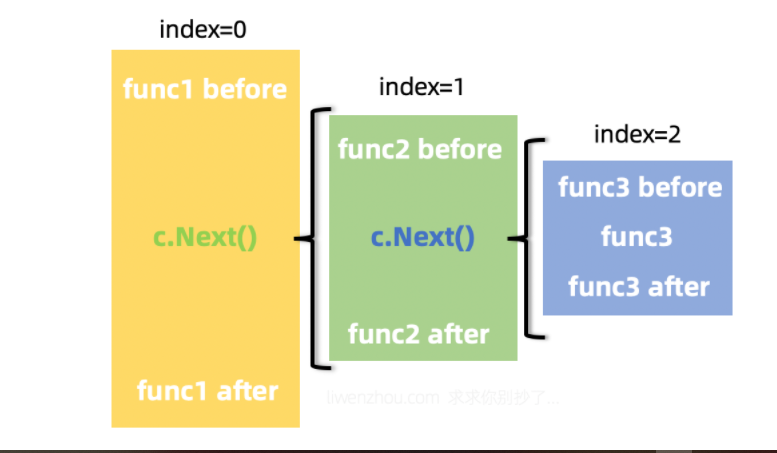
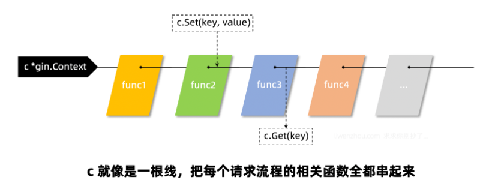

# 中间件
> gin框架涉及中间件相关有4个常用的方法，它们分别是c.Next()、c.Abort()、c.Set()、c.Get()
## 1.中间件的注册
gin框架中的中间件设计很巧妙，我们可以首先从我们最常用的`r := gin.Default()`的`Default`函数开始看，它内部构造一个新的engine之后就通过Use()函数注册了Logger中间件和Recovery中间件：
```go
func Default() *Engine {
	debugPrintWARNINGDefault()
	engine := New()
	engine.Use(Logger(), Recovery())  // 默认注册的两个中间件
	return engine
}
````
继续往下查看一下Use()函数的代码：
```go
func (engine *Engine) Use(middleware ...HandlerFunc) IRoutes {
	engine.RouterGroup.Use(middleware...)  // 实际上还是调用的RouterGroup的Use函数
	engine.rebuild404Handlers()
	engine.rebuild405Handlers()
	return engine
}
````
从下方的代码可以看出，注册中间件其实就是将中间件函数追加到group.Handlers中：
```go
func (group *RouterGroup) Use(middleware ...HandlerFunc) IRoutes {
	group.Handlers = append(group.Handlers, middleware...)
	return group.returnObj()
}
````
而我们注册路由时会将对应路由的函数和之前的中间件函数结合到一起：
```go
func (group *RouterGroup) handle(httpMethod, relativePath string, handlers HandlersChain) IRoutes {
	absolutePath := group.calculateAbsolutePath(relativePath)
	handlers = group.combineHandlers(handlers)  // 将处理请求的函数与中间件函数结合
	group.engine.addRoute(httpMethod, absolutePath, handlers)
	return group.returnObj()
}
````
其中结合操作的函数内容如下，注意观察这里是如何实现拼接两个切片得到一个新切片的。
```go
const abortIndex int8 = math.MaxInt8 / 2

func (group *RouterGroup) combineHandlers(handlers HandlersChain) HandlersChain {
	finalSize := len(group.Handlers) + len(handlers)
	if finalSize >= int(abortIndex) {  // 这里有一个最大限制
		panic("too many handlers")
	}
	mergedHandlers := make(HandlersChain, finalSize)
	copy(mergedHandlers, group.Handlers)
	copy(mergedHandlers[len(group.Handlers):], handlers)
	return mergedHandlers
}
````
也就是说，我们会将一个路由的中间件函数和处理函数结合到一起组成一条处理函数链条HandlersChain，而它本质上就是一个由HandlerFunc组成的切片 ``type HandlersChain []HandlerFunc``
## 2. 中间件的执行
我们在上面路由匹配的时候见过如下逻辑：
```go
value := root.getValue(rPath, c.Params, unescape)
if value.handlers != nil {
  c.handlers = value.handlers
  c.Params = value.params
  c.fullPath = value.fullPath
  c.Next()  // 执行函数链条
  c.writermem.WriteHeaderNow()
  return
}
````
其中c.Next()就是很关键的一步，它的代码很简单：
```go
func (c *Context) Next() {
	c.index++
	for c.index < int8(len(c.handlers)) {
		c.handlers[c.index](c)
		c.index++
	}
}
````
从上面的代码可以看到，这里通过索引遍历HandlersChain链条，从而实现依次调用该路由的每一个函数（中间件或处理请求的函数）。


我们可以在中间件函数中通过再次调用c.Next()实现嵌套调用（func1中调用func2；func2中调用func3），



或者通过调用c.Abort()中断整个调用链条，从当前函数返回。

```go
func (c *Context) Abort() {
	c.index = abortIndex  // 直接将索引置为最大限制值，从而退出循环
}
````
## 3 c.Set()/c.Get()
c.Set()和c.Get()这两个方法多用于在多个函数之间通过c传递数据的，比如我们可以在认证中间件中获取当前请求的相关信息（userID等）通过c.Set()存入c，然后在后续处理业务逻辑的函数中通过c.Get()来获取当前请求的用户。c就像是一根绳子，将该次请求相关的所有的函数都串起来了。



## 4 summery
- gin框架路由使用前缀树，路由注册的过程是构造前缀树的过程，路由匹配的过程就是查找前缀树的过程。
- gin框架的中间件函数和处理函数是以切片形式的调用链条存在的，我们可以顺序调用也可以借助c.Next()方法实现嵌套调用。
- 借助c.Set()和c.Get()方法我们能够在不同的中间件函数中传递数据。


