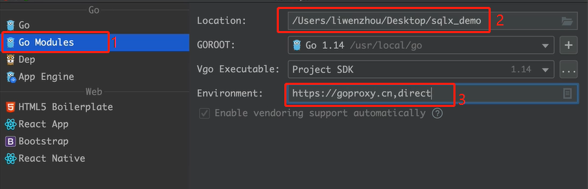
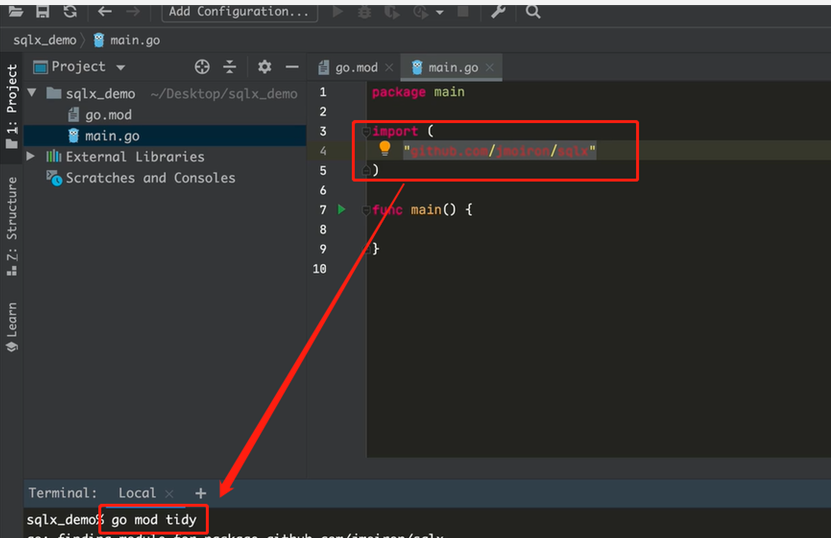
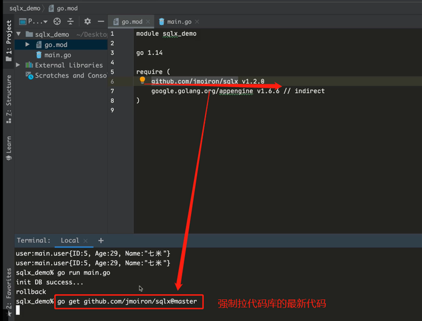
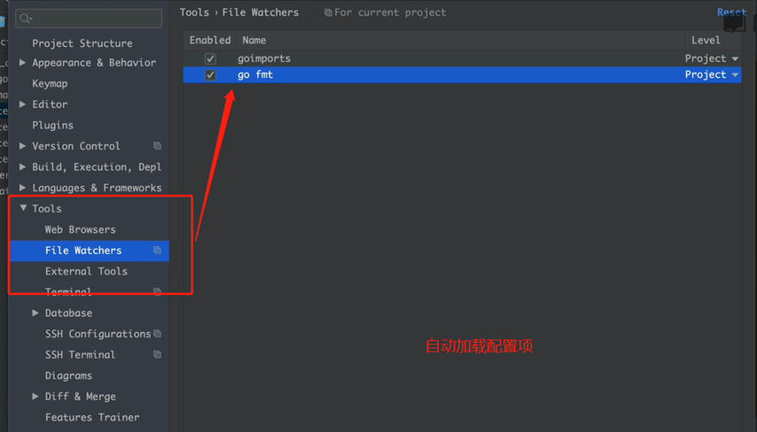
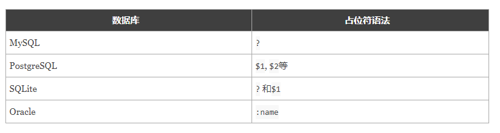
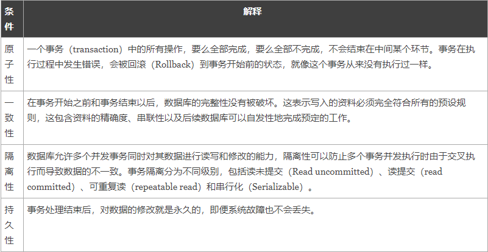

# Go语言操作MySQL
## 0.创建项目







## 1. 连接
Go语言中的database/sql包提供了保证SQL或类SQL数据库的泛用接口，并不提供具体的数据库驱动。使用database/sql包时必须注入（至少）一个数据库驱动

我们常用的数据库基本上都有完整的第三方实现。例如：[MySQL驱动](https://github.com/go-sql-driver/mysql)

#### 下载依赖:
``go get -u github.com/go-sql-driver/mysql``

#### 使用MySQL驱动
``func Open(driverName, dataSourceName string) (*DB, error)``

Open打开一个dirverName指定的数据库，dataSourceName指定数据源，一般至少包括数据库文件名和其它连接必要的信息。
```go
import (
	"database/sql"

	_ "github.com/go-sql-driver/mysql"
)

func main() {
   // DSN:Data Source Name
	dsn := "user:password@tcp(127.0.0.1:3306)/dbname"
	db, err := sql.Open("mysql", dsn)
	if err != nil {
		panic(err)
	}
	defer db.Close()  // 注意这行代码要写在上面err判断的下面
}
````
#### 初始化连接
Open函数可能只是验证其参数格式是否正确，实际上并不创建与数据库的连接。如果要检查数据源的名称是否真实有效，应该调用Ping方法。

返回的DB对象可以安全地被多个goroutine并发使用，并且维护其自己的空闲连接池。因此，Open函数应该仅被调用一次，很少需要关闭这个DB对象。
```go
// 定义一个全局对象db
var db *sql.DB

// 定义一个初始化数据库的函数
func initDB() (err error) {
	// DSN:Data Source Name
	dsn := "user:password@tcp(127.0.0.1:3306)/sql_test?charset=utf8mb4&parseTime=True"
	// 不会校验账号密码是否正确
	// 注意！！！这里不要使用:=，我们是给全局变量赋值，然后在main函数中使用全局变量db
	db, err = sql.Open("mysql", dsn)
	if err != nil {
		return err
	}
	// 尝试与数据库建立连接（校验dsn是否正确）
	err = db.Ping()
	if err != nil {
		return err
	}
	return nil
}

func main() {
	err := initDB() // 调用输出化数据库的函数
	if err != nil {
		fmt.Printf("init db failed,err:%v\n", err)
		return
	}
}
````
其中sql.DB是表示连接的数据库对象（结构体实例），它保存了连接数据库相关的所有信息。它内部维护着一个具有零到多个底层连接的连接池，它可以安全地被多个goroutine同时使用。
#### SetMaxOpenConns
``func (db *DB) SetMaxOpenConns(n int)``

SetMaxOpenConns设置与数据库建立连接的最大数目。 如果n大于0且小于最大闲置连接数，会将最大闲置连接数减小到匹配最大开启连接数的限制。 如果n<=0，不会限制最大开启连接数，默认为0（无限制）。

#### SetMaxIdleConns
``func (db *DB) SetMaxIdleConns(n int)``

SetMaxIdleConns设置连接池中的最大闲置连接数。 如果n大于最大开启连接数，则新的最大闲置连接数会减小到匹配最大开启连接数的限制。 如果n<=0，不会保留闲置连接。

## 2. CRUD
实例数据库
```sql
CREATE TABLE `user` (
    `id` BIGINT(20) NOT NULL AUTO_INCREMENT,
    `name` VARCHAR(20) DEFAULT '',
    `age` INT(11) DEFAULT '0',
    PRIMARY KEY(`id`)
)ENGINE=InnoDB AUTO_INCREMENT=1 DEFAULT CHARSET=utf8mb4;
````
为了方便查询，我们事先定义好一个结构体来存储user表的数据。
```go
type user struct {
	id   int
	age  int
	name string
}
````
### 2.1 查询
#### 单条查询
单行查询db.QueryRow()执行一次查询，并期望返回最多一行结果（即Row）。QueryRow总是返回非nil的值，直到返回值的Scan方法被调用时，才会返回被延迟的错误。（如：未找到结果）

``func (db *DB) QueryRow(query string, args ...interface{}) *Row``

具体示例代码：
```go
// 查询单条数据示例
func queryRowDemo() {
	sqlStr := "select id, name, age from user where id=?"
	var u user
	// 非常重要：确保QueryRow之后调用Scan方法，否则持有的数据库链接不会被释放
	err := db.QueryRow(sqlStr, 1).Scan(&u.id, &u.name, &u.age)
	if err != nil {
		fmt.Printf("scan failed, err:%v\n", err)
		return
	}
	fmt.Printf("id:%d name:%s age:%d\n", u.id, u.name, u.age)
}
````
#### 多行查询
多行查询db.Query()执行一次查询，返回多行结果（即Rows），一般用于执行select命令。参数args表示query中的占位参数。

``func (db *DB) Query(query string, args ...interface{}) (*Rows, error)``

具体示例代码：
```go
// 查询多条数据示例
func queryMultiRowDemo() {
	sqlStr := "select id, name, age from user where id > ?"
	rows, err := db.Query(sqlStr, 0)
	if err != nil {
		fmt.Printf("query failed, err:%v\n", err)
		return
	}
	// 非常重要：关闭rows释放持有的数据库链接
	defer rows.Close()

	// 循环读取结果集中的数据
	for rows.Next() {
		var u user
		err := rows.Scan(&u.id, &u.name, &u.age)
		if err != nil {
			fmt.Printf("scan failed, err:%v\n", err)
			return
		}
		fmt.Printf("id:%d name:%s age:%d\n", u.id, u.name, u.age)
	}
}
````
### 2.2 插入数据
插入、更新和删除操作都使用Exec方法。

``func (db *DB) Exec(query string, args ...interface{}) (Result, error)``

Exec执行一次命令（包括查询、删除、更新、插入等），返回的Result是对已执行的SQL命令的总结。参数args表示query中的占位参数。

具体插入数据示例代码如下：
```go
// 插入数据
func insertRowDemo() {
	sqlStr := "insert into user(name, age) values (?,?)"
	ret, err := db.Exec(sqlStr, "王五", 38)
	if err != nil {
		fmt.Printf("insert failed, err:%v\n", err)
		return
	}
	theID, err := ret.LastInsertId() // 新插入数据的id
	if err != nil {
		fmt.Printf("get lastinsert ID failed, err:%v\n", err)
		return
	}
	fmt.Printf("insert success, the id is %d.\n", theID)
}
````
### 2.3 更新数据
```go
// 更新数据
func updateRowDemo() {
	sqlStr := "update user set age=? where id = ?"
	ret, err := db.Exec(sqlStr, 39, 3)
	if err != nil {
		fmt.Printf("update failed, err:%v\n", err)
		return
	}
	n, err := ret.RowsAffected() // 操作影响的行数
	if err != nil {
		fmt.Printf("get RowsAffected failed, err:%v\n", err)
		return
	}
	fmt.Printf("update success, affected rows:%d\n", n)
}
````
### 2.4 删除数据
```go
// 删除数据
func deleteRowDemo() {
	sqlStr := "delete from user where id = ?"
	ret, err := db.Exec(sqlStr, 3)
	if err != nil {
		fmt.Printf("delete failed, err:%v\n", err)
		return
	}
	n, err := ret.RowsAffected() // 操作影响的行数
	if err != nil {
		fmt.Printf("get RowsAffected failed, err:%v\n", err)
		return
	}
	fmt.Printf("delete success, affected rows:%d\n", n)
}
````
## 3. 预处理
#### 普通SQL语句执行过程：
- 客户端对SQL语句进行占位符替换得到完整的SQL语句。
- 客户端发送完整SQL语句到MySQL服务端
- MySQL服务端执行完整的SQL语句并将结果返回给客户端
#### 预处理执行过程：
- 把SQL语句分成两部分，命令部分与数据部分。
- 先把命令部分发送给MySQL服务端，MySQL服务端进行SQL预处理。
- 然后把数据部分发送给MySQL服务端，MySQL服务端对SQL语句进行占位符替换。
- MySQL服务端执行完整的SQL语句并将结果返回给客户端。
#### 为什么要预处理？
- 优化MySQL服务器重复执行SQL的方法，可以提升服务器性能，提前让服务器编译，一次编译多次执行，节省后续编译的成本。
- 避免SQL注入问题
### 3.1 Go实现MySQL预处理
database/sql中使用下面的Prepare方法来实现预处理操作。

``func (db *DB) Prepare(query string) (*Stmt, error)``

Prepare方法会先将sql语句发送给MySQL服务端，返回一个准备好的状态用于之后的查询和命令。返回值可以同时执行多个查询和命令。
```go
// 预处理查询示例
func prepareQueryDemo() {
	sqlStr := "select id, name, age from user where id > ?"
	stmt, err := db.Prepare(sqlStr)
	if err != nil {
		fmt.Printf("prepare failed, err:%v\n", err)
		return
	}
	defer stmt.Close()
	rows, err := stmt.Query(0)
	if err != nil {
		fmt.Printf("query failed, err:%v\n", err)
		return
	}
	defer rows.Close()
	// 循环读取结果集中的数据
	for rows.Next() {
		var u user
		err := rows.Scan(&u.id, &u.name, &u.age)
		if err != nil {
			fmt.Printf("scan failed, err:%v\n", err)
			return
		}
		fmt.Printf("id:%d name:%s age:%d\n", u.id, u.name, u.age)
	}
}
````
插入、更新和删除操作的预处理十分类似，这里以插入操作的预处理为例：

```go
// 预处理插入示例
func prepareInsertDemo() {
	sqlStr := "insert into user(name, age) values (?,?)"
	stmt, err := db.Prepare(sqlStr)
	if err != nil {
		fmt.Printf("prepare failed, err:%v\n", err)
		return
	}
	defer stmt.Close()
	_, err = stmt.Exec("小王子", 18)
	if err != nil {
		fmt.Printf("insert failed, err:%v\n", err)
		return
	}
	_, err = stmt.Exec("沙河娜扎", 18)
	if err != nil {
		fmt.Printf("insert failed, err:%v\n", err)
		return
	}
	fmt.Println("insert success.")
}
````
SQL注入问题 ....



## 4. 事务
通常事务必须满足4个条件（ACID）：原子性（Atomicity，或称不可分割性）、一致性（Consistency）、隔离性（Isolation，又称独立性）、持久性（Durability）。


#### 相关方法
- func (db *DB) Begin() (*Tx, error)
- func (tx *Tx) Commit() error
- func (tx *Tx) Rollback() error

实例
```go
// 事务操作示例
func transactionDemo() {
	tx, err := db.Begin() // 开启事务
	if err != nil {
		if tx != nil {
			tx.Rollback() // 回滚
		}
		fmt.Printf("begin trans failed, err:%v\n", err)
		return
	}
	sqlStr1 := "Update user set age=30 where id=?"
	ret1, err := tx.Exec(sqlStr1, 2)
	if err != nil {
		tx.Rollback() // 回滚
		fmt.Printf("exec sql1 failed, err:%v\n", err)
		return
	}
	affRow1, err := ret1.RowsAffected()
	if err != nil {
		tx.Rollback() // 回滚
		fmt.Printf("exec ret1.RowsAffected() failed, err:%v\n", err)
		return
	}

	sqlStr2 := "Update user set age=40 where id=?"
	ret2, err := tx.Exec(sqlStr2, 3)
	if err != nil {
		tx.Rollback() // 回滚
		fmt.Printf("exec sql2 failed, err:%v\n", err)
		return
	}
	affRow2, err := ret2.RowsAffected()
	if err != nil {
		tx.Rollback() // 回滚
		fmt.Printf("exec ret1.RowsAffected() failed, err:%v\n", err)
		return
	}

	fmt.Println(affRow1, affRow2)
	if affRow1 == 1 && affRow2 == 1 {
		fmt.Println("事务提交啦...")
		tx.Commit() // 提交事务
	} else {
		tx.Rollback()
		fmt.Println("事务回滚啦...")
	}

	fmt.Println("exec trans success!")
}
````

