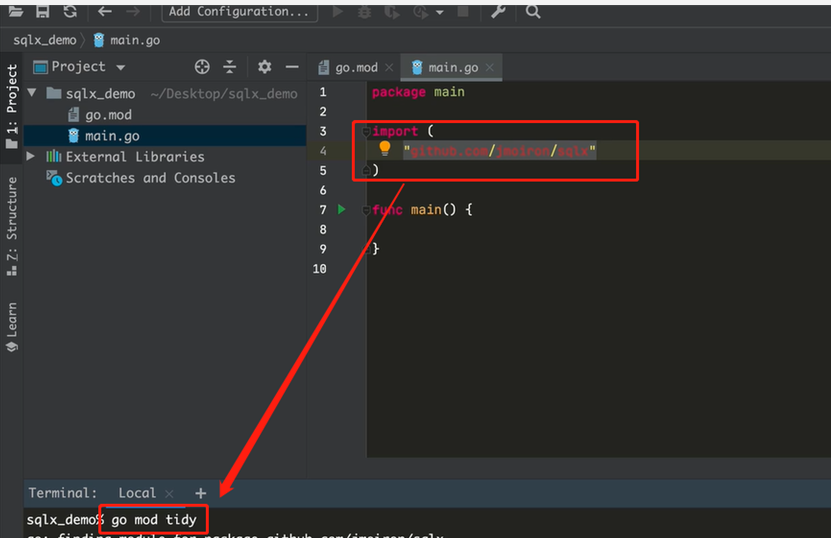
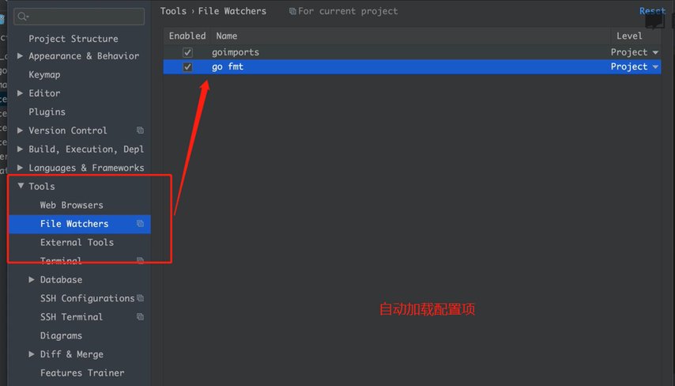

# sqlx库使用
在项目中我们通常可能会使用database/sql连接MySQL数据库。本文借助使用sqlx实现批量插入数据的例子，介绍了sqlx中可能被你忽视了的sqlx.In和DB.NamedExec方法。
## 0.创建项目






## 1. 简介及使用
>在项目中我们通常可能会使用database/sql连接MySQL数据库。sqlx可以认为是Go语言内置database/sql的超集，它在优秀的内置database/sql基础上提供了一组扩展。这些扩展中除了大家常用来查询的Get(dest interface{}, ...) error和Select(dest interface{}, ...) error外还有很多其他强大的功能。

### 1.1 安装sqlx
``go get github.com/jmoiron/sqlx``
### 1.2 基本使用
#### 连接数据库
```go
var db *sqlx.DB

func initDB() (err error) {
    dsn := "user:password@tcp(127.0.0.1:3306)/sql_test?charset=utf8mb4&parseTime=True"
    // 也可以使用MustConnect连接不成功就panic
    db, err = sqlx.Connect("mysql", dsn)
    if err != nil {
    fmt.Printf("connect DB failed, err:%v\n", err)
    return
    }
    db.SetMaxOpenConns(20)
    db.SetMaxIdleConns(10)
    return
}
````
#### 查询单条
```go
// 查询单条数据示例
func queryRowDemo() {
	sqlStr := "select id, name, age from user where id=?"
	var u user
	err := db.Get(&u, sqlStr, 1)
	if err != nil {
		fmt.Printf("get failed, err:%v\n", err)
		return
	}
	fmt.Printf("id:%d name:%s age:%d\n", u.ID, u.Name, u.Age)
}
````
#### 查询多行数据
```go
// 查询多条数据示例
func queryMultiRowDemo() {
	sqlStr := "select id, name, age from user where id > ?"
	var users []user
	err := db.Select(&users, sqlStr, 0)
	if err != nil {
		fmt.Printf("query failed, err:%v\n", err)
		return
	}
	fmt.Printf("users:%#v\n", users)
}
````
#### 插入、更新和删除
sqlx中的exec方法与原生sql中的exec使用基本一致：
```go
// 插入数据
func insertRowDemo() {
	sqlStr := "insert into user(name, age) values (?,?)"
	ret, err := db.Exec(sqlStr, "沙河小王子", 19)
	if err != nil {
		fmt.Printf("insert failed, err:%v\n", err)
		return
	}
	theID, err := ret.LastInsertId() // 新插入数据的id
	if err != nil {
		fmt.Printf("get lastinsert ID failed, err:%v\n", err)
		return
	}
	fmt.Printf("insert success, the id is %d.\n", theID)
}

// 更新数据
func updateRowDemo() {
	sqlStr := "update user set age=? where id = ?"
	ret, err := db.Exec(sqlStr, 39, 6)
	if err != nil {
		fmt.Printf("update failed, err:%v\n", err)
		return
	}
	n, err := ret.RowsAffected() // 操作影响的行数
	if err != nil {
		fmt.Printf("get RowsAffected failed, err:%v\n", err)
		return
	}
	fmt.Printf("update success, affected rows:%d\n", n)
}

// 删除数据
func deleteRowDemo() {
	sqlStr := "delete from user where id = ?"
	ret, err := db.Exec(sqlStr, 6)
	if err != nil {
		fmt.Printf("delete failed, err:%v\n", err)
		return
	}
	n, err := ret.RowsAffected() // 操作影响的行数
	if err != nil {
		fmt.Printf("get RowsAffected failed, err:%v\n", err)
		return
	}
	fmt.Printf("delete success, affected rows:%d\n", n)
}
````
#### NamedExec
DB.NamedExec方法用来绑定SQL语句与结构体或map中的同名字段。
```go
func insertUserDemo()(err error){
	sqlStr := "INSERT INTO user (name,age) VALUES (:name,:age)"
	_, err = db.NamedExec(sqlStr,
		map[string]interface{}{
			"name": "will",
			"age": 18,
		})
	return
}
````
#### NamedQuery
与DB.NamedExec同理，这里是支持查询。
```go
func namedQuery(){
	sqlStr := "SELECT * FROM user WHERE name=:name"
	// 使用map做命名查询
	rows, err := db.NamedQuery(sqlStr, map[string]interface{}{"name": "will"})
	if err != nil {
		fmt.Printf("db.NamedQuery failed, err:%v\n", err)
		return
	}
	defer rows.Close()
	for rows.Next(){
		var u user
		err := rows.StructScan(&u)
		if err != nil {
			fmt.Printf("scan failed, err:%v\n", err)
			continue
		}
		fmt.Printf("user:%#v\n", u)
	}

	u := user{
		Name: "will",
	}
	// 使用结构体命名查询，根据结构体字段的 db tag进行映射
	rows, err = db.NamedQuery(sqlStr, u)
	if err != nil {
		fmt.Printf("db.NamedQuery failed, err:%v\n", err)
		return
	}
	defer rows.Close()
	for rows.Next(){
		var u user
		err := rows.StructScan(&u)
		if err != nil {
			fmt.Printf("scan failed, err:%v\n", err)
			continue
		}
		fmt.Printf("user:%#v\n", u)
	}
}
````
#### 事务
对于事务操作，我们可以使用sqlx中提供的db.Beginx()和tx.Exec()方法。示例代码如下：
```go
func transactionDemo2()(err error) {
	tx, err := db.Beginx() // 开启事务
	if err != nil {
		fmt.Printf("begin trans failed, err:%v\n", err)
		return err
	}
	defer func() {
		if p := recover(); p != nil {
			tx.Rollback()
			panic(p) // re-throw panic after Rollback
		} else if err != nil {
			fmt.Println("rollback")
			tx.Rollback() // err is non-nil; don't change it
		} else {
			err = tx.Commit() // err is nil; if Commit returns error update err
			fmt.Println("commit")
		}
	}()

	sqlStr1 := "Update user set age=20 where id=?"

	rs, err := tx.Exec(sqlStr1, 1)
	if err!= nil{
		return err
	}
	n, err := rs.RowsAffected()
	if err != nil {
		return err
	}
	if n != 1 {
		return errors.New("exec sqlStr1 failed")
	}
	sqlStr2 := "Update user set age=50 where i=?"
	rs, err = tx.Exec(sqlStr2, 5)
	if err!=nil{
		return err
	}
	n, err = rs.RowsAffected()
	if err != nil {
		return err
	}
	if n != 1 {
		return errors.New("exec sqlStr1 failed")
	}
	return err
}
````
## 2. sqlx.In
>sqlx.In是sqlx提供的一个非常方便的函数
### 2.1 sqlx.In的批量插入示例
表结构:
```sql
CREATE TABLE `user` (
    `id` BIGINT(20) NOT NULL AUTO_INCREMENT,
    `name` VARCHAR(20) DEFAULT '',
    `age` INT(11) DEFAULT '0',
    PRIMARY KEY(`id`)
)ENGINE=InnoDB AUTO_INCREMENT=1 DEFAULT CHARSET=utf8mb4;
````
#### 结构体
定义一个user结构体，字段通过tag与数据库中user表的列一致。
```go
type User struct {
	Name string `db:"name"`
	Age  int    `db:"age"`
}
````
#### bindvars（绑定变量）
> 查询占位符?在内部称为bindvars（查询占位符）,它非常重要。你应该始终使用它们向数据库发送值，因为它们可以防止SQL注入攻击。database/sql不尝试对查询文本进行任何验证；它与编码的参数一起按原样发送到服务器。除非驱动程序实现一个特殊的接口，否则在执行之前，查询是在服务器上准备的。因此bindvars是特定于数据库的:

- MySQL中使用?
- PostgreSQL使用枚举的$1、$2等bindvar语法
- SQLite中?和$1的语法都支持
- Oracle中使用:name的语法

bindvars的一个常见误解是，它们用来在sql语句中插入值。它们其实仅用于参数化，不允许更改SQL语句的结构。例如，使用bindvars尝试参数化列或表名将不起作用:
```go
// ？不能用来插入表名（做SQL语句中表名的占位符）
db.Query("SELECT * FROM ?", "mytable")
 
// ？也不能用来插入列名（做SQL语句中列名的占位符）
db.Query("SELECT ?, ? FROM people", "name", "location")
````
#### 拼接语句实现批量插入(不推荐)
```go
// BatchInsertUsers 自行构造批量插入的语句
func BatchInsertUsers(users []*User) error {
	// 存放 (?, ?) 的slice
	valueStrings := make([]string, 0, len(users))
	// 存放values的slice
	valueArgs := make([]interface{}, 0, len(users) * 2)
	// 遍历users准备相关数据
	for _, u := range users {
		// 此处占位符要与插入值的个数对应
		valueStrings = append(valueStrings, "(?, ?)")
		valueArgs = append(valueArgs, u.Name)
		valueArgs = append(valueArgs, u.Age)
	}
	// 自行拼接要执行的具体语句
	stmt := fmt.Sprintf("INSERT INTO user (name, age) VALUES %s",
		strings.Join(valueStrings, ","))
	_, err := DB.Exec(stmt, valueArgs...)
	return err
}
````
#### 使用sqlx.In实现批量插入
前提是需要我们的结构体实现driver.Valuer接口：
```go
func (u User) Value() (driver.Value, error) {
	return []interface{}{u.Name, u.Age}, nil
}
````
把上面三种方法综合起来试一下：
```go
func main() {
	err := initDB()
	if err != nil {
		panic(err)
	}
	defer DB.Close()
	u1 := User{Name: "will", Age: 18}
	u2 := User{Name: "q1mi", Age: 28}
	u3 := User{Name: "小王子", Age: 38}

	// 方法1
	users := []*User{&u1, &u2, &u3}
	err = BatchInsertUsers(users)
	if err != nil {
		fmt.Printf("BatchInsertUsers failed, err:%v\n", err)
	}

	// 方法2
	users2 := []interface{}{u1, u2, u3}
	err = BatchInsertUsers2(users2)
	if err != nil {
		fmt.Printf("BatchInsertUsers2 failed, err:%v\n", err)
	}

	// 方法3
	users3 := []*User{&u1, &u2, &u3}
	err = BatchInsertUsers3(users3)
	if err != nil {
		fmt.Printf("BatchInsertUsers3 failed, err:%v\n", err)
	}
}
````
#### sqlx.In的查询示例
关于sqlx.In这里再补充一个用法，在sqlx查询语句中实现In查询和FIND_IN_SET函数。即实现`SELECT * FROM user WHERE id in (3, 2, 1);和SELECT * FROM user WHERE id in (3, 2, 1) ORDER BY FIND_IN_SET(id, '3,2,1')`;
#### in查询
```go
// QueryByIDs 根据给定ID查询
func QueryByIDs(ids []int)(users []User, err error){
	// 动态填充id
	query, args, err := sqlx.In("SELECT name, age FROM user WHERE id IN (?)", ids)
	if err != nil {
		return
	}
	// sqlx.In 返回带 `?` bindvar的查询语句, 我们使用Rebind()重新绑定它
	query = DB.Rebind(query)

	err = DB.Select(&users, query, args...)
	return
}
````
#### in查询和FIND_IN_SET函数
查询id在给定id集合的数据并维持给定id集合的顺序。
```go
// QueryAndOrderByIDs 按照指定id查询并维护顺序
func QueryAndOrderByIDs(ids []int)(users []User, err error){
	// 动态填充id
	strIDs := make([]string, 0, len(ids))
	for _, id := range ids {
		strIDs = append(strIDs, fmt.Sprintf("%d", id))
	}
	query, args, err := sqlx.In("SELECT name, age FROM user WHERE id IN (?) ORDER BY FIND_IN_SET(id, ?)", ids, strings.Join(strIDs, ","))
	if err != nil {
		return
	}

	// sqlx.In 返回带 `?` bindvar的查询语句, 我们使用Rebind()重新绑定它
	query = DB.Rebind(query)

	err = DB.Select(&users, query, args...)
	return
}
````

#### [帮助文档](http://jmoiron.github.io/sqlx/)

