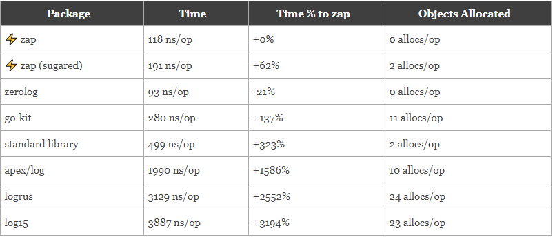

# zap日志库
## 0.创建项目
````
go env -w GOPROXY=https://goproxy.io,direct
go env -w GO111MODULE=on

可以用go env -u 恢复初始设置；GOPROXY的值应该还可以是https://mirrors.aliyun.com/goproxy/  或 https://goproxy.cn

引入imports工具可能出现问题解决方式: https://studygolang.com/articles/18284
````


## 1.简介
在许多Go语言项目中，我们需要一个好的日志记录器能够提供下面这些功能：
- 能够将事件记录到文件中，而不是应用程序控制台。
- 日志切割-能够根据文件大小、时间或间隔等来切割日志文件。
- 支持不同的日志级别。例如INFO，DEBUG，ERROR等。
- 能够打印基本信息，如调用文件/函数名和行号，日志时间等。
#### 默认的Go Logger
在介绍Uber-go的zap包之前，让我们先看看Go语言提供的基本日志功能。Go语言提供的默认日志包是https://golang.org/pkg/log/。
#### 设置Logger
```go
func SetupLogger() {
	logFileLocation, _ := os.OpenFile("/Users/q1mi/test.log", os.O_CREATE|os.O_APPEND|os.O_RDWR, 0744)
	log.SetOutput(logFileLocation)
}
````
#### 使用Logger
在当前的示例中，我们将建立一个到URL的HTTP连接，并将状态代码/错误记录到日志文件中。
```go
func simpleHttpGet(url string) {
	resp, err := http.Get(url)
	if err != nil {
		log.Printf("Error fetching url %s : %s", url, err.Error())
	} else {
		log.Printf("Status Code for %s : %s", url, resp.Status)
		resp.Body.Close()
	}
}
````
#### Logger的运行
现在让我们执行上面的代码并查看日志记录器的运行情况。
```go
func main() {
	SetupLogger()
	simpleHttpGet("www.google.com")
	simpleHttpGet("http://www.google.com")
}
````
当我们执行上面的代码，我们能看到一个test.log文件被创建，下面的内容会被添加到这个日志文件中。
```go
2021/05/16 01:14:13 Error fetching url www.google.com : Get www.google.com: unsupported protocol scheme ""
2021/05/16 01:14:14 Status Code for http://www.google.com : 200 OK
````
### Go Logger的优势和劣势
#### 优势
它最大的优点是使用非常简单。我们可以设置任何io.Writer作为日志记录输出并向其发送要写入的日志。
#### 劣势
- 仅限基本的日志级别
- - 只有一个Print选项。不支持INFO/DEBUG等多个级别。
- 对于错误日志，它有Fatal和Panic 
- - Fatal日志通过调用os.Exit(1)来结束程序
- - Panic日志在写入日志消息之后抛出一个panic
- - 但是它缺少一个ERROR日志级别，这个级别可以在不抛出panic或退出程序的情况下记录错误
- 缺乏日志格式化的能力——例如记录调用者的函数名和行号，格式化日期和时间格式。等等。
- 不提供日志切割的能力。
## 2.[Uber-go Zap](https://github.com/uber-go/zap)
Zap是非常快的、结构化的，分日志级别的Go日志库。

它同时提供了结构化日志记录和printf风格的日志记录
它非常的快
根据Uber-go Zap的文档，它的性能比类似的结构化日志包更好——也比标准库更快。 以下是Zap发布的基准测试信息
#### 记录一条消息和10个字段:

#### 记录一个静态字符串，没有任何上下文或printf风格的模板：

### 安装
``go get -u go.uber.org/zap``
### 配置Zap Logger
Zap提供了两种类型的日志记录器—Sugared Logger和Logger。

在性能很好但不是很关键的上下文中，使用SugaredLogger。它比其他结构化日志记录包快4-10倍，并且支持结构化和printf风格的日志记录。

在每一微秒和每一次内存分配都很重要的上下文中，使用Logger。它甚至比SugaredLogger更快，内存分配次数也更少，但它只支持强类型的结构化日志记录。
### Logger
- 通过调用zap.NewProduction()/zap.NewDevelopment()或者zap.Example()创建一个Logger。
- 上面的每一个函数都将创建一个logger。唯一的区别在于它将记录的信息不同。例如production logger默认记录调用函数信息、日期和时间等。
- 通过Logger调用Info/Error等。
- 默认情况下日志都会打印到应用程序的console界面。
```go
var logger *zap.Logger

func main() {
	InitLogger()
  defer logger.Sync()
	simpleHttpGet("www.google.com")
	simpleHttpGet("http://www.google.com")
}

func InitLogger() {
	logger, _ = zap.NewProduction()
}

func simpleHttpGet(url string) {
	resp, err := http.Get(url)
	if err != nil {
		logger.Error(
			"Error fetching url..",
			zap.String("url", url),
			zap.Error(err))
	} else {
		logger.Info("Success..",
			zap.String("statusCode", resp.Status),
			zap.String("url", url))
		resp.Body.Close()
	}
}
````
在上面的代码中，我们首先创建了一个Logger，然后使用Info/ Error等Logger方法记录消息。

日志记录器方法的语法是这样的：

``func (log *Logger) MethodXXX(msg string, fields ...Field) ``

其中MethodXXX是一个可变参数函数，可以是Info / Error/ Debug / Panic等。每个方法都接受一个消息字符串和任意数量的zapcore.Field场参数。

每个zapcore.Field其实就是一组键值对参数。

我们执行上面的代码会得到如下输出结果：
```go
{"level":"error","ts":1572159218.912792,"caller":"zap_demo/temp.go:25","msg":"Error fetching url..","url":"www.sogo.com","error":"Get www.sogo.com: unsupported protocol scheme \"\"","stacktrace":"main.simpleHttpGet\n\t/Users/q1mi/zap_demo/temp.go:25\nmain.main\n\t/Users/q1mi/zap_demo/temp.go:14\nruntime.main\n\t/usr/local/go/src/runtime/proc.go:203"}
{"level":"info","ts":1572159219.1227388,"caller":"zap_demo/temp.go:30","msg":"Success..","statusCode":"200 OK","url":"http://www.sogo.com"}
````
### Sugared Logger
现在让我们使用Sugared Logger来实现相同的功能。

- 大部分的实现基本都相同。
- 惟一的区别是，我们通过调用主logger的. Sugar()方法来获取一个SugaredLogger。
- 然后使用SugaredLogger以printf格式记录语句

下面是修改过后使用SugaredLogger代替Logger的代码：
```go
var sugarLogger *zap.SugaredLogger

func main() {
	InitLogger()
	defer sugarLogger.Sync()
	simpleHttpGet("www.google.com")
	simpleHttpGet("http://www.google.com")
}

func InitLogger() {
  logger, _ := zap.NewProduction()
	sugarLogger = logger.Sugar()
}

func simpleHttpGet(url string) {
	sugarLogger.Debugf("Trying to hit GET request for %s", url)
	resp, err := http.Get(url)
	if err != nil {
		sugarLogger.Errorf("Error fetching URL %s : Error = %s", url, err)
	} else {
		sugarLogger.Infof("Success! statusCode = %s for URL %s", resp.Status, url)
		resp.Body.Close()
	}
}
````
结果:
````
{"level":"error","ts":1572159149.923002,"caller":"logic/temp2.go:27","msg":"Error fetching URL www.sogo.com : Error = Get www.sogo.com: unsupported protocol scheme \"\"","stacktrace":"main.simpleHttpGet\n\t/Users/q1mi/zap_demo/logic/temp2.go:27\nmain.main\n\t/Users/q1mi/zap_demo/logic/temp2.go:14\nruntime.main\n\t/usr/local/go/src/runtime/proc.go:203"}
{"level":"info","ts":1572159150.192585,"caller":"logic/temp2.go:29","msg":"Success! statusCode = 200 OK for URL http://www.sogo.com"}
````
你应该注意到的了，到目前为止这两个logger都打印输出JSON结构格式。
### 定制logger
#### 将日志写入文件而不是终端
我们要做的第一个更改是把日志写入文件，而不是打印到应用程序控制台
我们将使用zap.New(…)方法来手动传递所有配置，而不是使用像zap.NewProduction()这样的预置方法来创建logger

``func New(core zapcore.Core, options ...Option) *Logger``

zapcore.Core需要三个配置——Encoder，WriteSyncer，LogLevel。

#### Encoder:编码器(如何写入日志)。我们将使用开箱即用的NewJSONEncoder()，并使用预先设置的ProductionEncoderConfig()。 ``zapcore.NewJSONEncoder(zap.NewProductionEncoderConfig())``

#### WriterSyncer ：指定日志将写到哪里去。我们使用zapcore.AddSync()函数并且将打开的文件句柄传进去。
```go
 file, _ := os.Create("./test.log")
 writeSyncer := zapcore.AddSync(file)
````
#### Log Level：哪种级别的日志将被写入。
我们将修改上述部分中的Logger代码，并重写InitLogger()方法。其余方法—main() /SimpleHttpGet()保持不变。
```go
func InitLogger() {
	writeSyncer := getLogWriter()
	encoder := getEncoder()
	core := zapcore.NewCore(encoder, writeSyncer, zapcore.DebugLevel)

	logger := zap.New(core)
	sugarLogger = logger.Sugar()
}

func getEncoder() zapcore.Encoder {
	return zapcore.NewJSONEncoder(zap.NewProductionEncoderConfig())
}

func getLogWriter() zapcore.WriteSyncer {
	file, _ := os.Create("./test.log")
	return zapcore.AddSync(file)
}
````
当使用这些修改过的logger配置调用上述部分的main()函数时，以下输出将打印在文件——test.log中。
```go
{"level":"debug","ts":1572160754.994731,"msg":"Trying to hit GET request for www.sogo.com"}
{"level":"error","ts":1572160754.994982,"msg":"Error fetching URL www.sogo.com : Error = Get www.sogo.com: unsupported protocol scheme \"\""}
{"level":"debug","ts":1572160754.994996,"msg":"Trying to hit GET request for http://www.sogo.com"}
{"level":"info","ts":1572160757.3755069,"msg":"Success! statusCode = 200 OK for URL http://www.sogo.com"}
````
#### 将JSON Encoder更改为普通的Log Encoder
现在，我们希望将编码器从JSON Encoder更改为普通Encoder。为此，我们需要将NewJSONEncoder()更改为NewConsoleEncoder()。

``return zapcore.NewConsoleEncoder(zap.NewProductionEncoderConfig())``


当使用这些修改过的logger配置调用上述部分的main()函数时，以下输出将打印在文件——test.log中。

````
1.572161051846623e+09	debug	Trying to hit GET request for www.sogo.com
1.572161051846828e+09	error	Error fetching URL www.sogo.com : Error = Get www.sogo.com: unsupported protocol scheme ""
1.5721610518468401e+09	debug	Trying to hit GET request for http://www.sogo.com
1.572161052068744e+09	info	Success! statusCode = 200 OK for URL http://www.sogo.com
````
#### 更改时间编码并添加调用者详细信息
鉴于我们对配置所做的更改，有下面两个问题：
- 时间是以非人类可读的方式展示，例如1.572161051846623e+09
- 调用方函数的详细信息没有显示在日志中
我们要做的第一件事是覆盖默认的ProductionConfig()，并进行以下更改:
- 修改时间编码器
- 在日志文件中使用大写字母记录日志级别
```go
func getEncoder() zapcore.Encoder {
	encoderConfig := zap.NewProductionEncoderConfig()
	encoderConfig.EncodeTime = zapcore.ISO8601TimeEncoder
	encoderConfig.EncodeLevel = zapcore.CapitalLevelEncoder
	return zapcore.NewConsoleEncoder(encoderConfig)
}
````
接下来，我们将修改zap logger代码，添加将调用函数信息记录到日志中的功能。为此，我们将在zap.New(..)函数中添加一个Option。

``logger := zap.New(core, zap.AddCaller())``

当使用这些修改过的logger配置调用上述部分的main()函数时，以下输出将打印在文件——test.log中。

````
2021-05-27T15:33:29.855+0800	DEBUG	logic/temp2.go:47	Trying to hit GET request for www.sogo.com
2021-05-27T15:33:29.855+0800	ERROR	logic/temp2.go:50	Error fetching URL www.sogo.com : Error = Get www.sogo.com: unsupported protocol scheme ""
2021-05-27T15:33:29.856+0800	DEBUG	logic/temp2.go:47	Trying to hit GET request for http://www.sogo.com
2021-05-27T15:33:30.125+0800	INFO	logic/temp2.go:52	Success! statusCode = 200 OK for URL http://www.sogo.com
````
## 3.使用[Lumberjack](https://github.com/natefinch/lumberjack)进行日志切割归档
这个日志程序中唯一缺少的就是日志切割归档功能。

为了添加日志切割归档功能，我们将使用第三方库Lumberjack来实现。
### 安装
``go get -u github.com/natefinch/lumberjack``
### zap logger中加入Lumberjack
要在zap中加入Lumberjack支持，我们需要修改WriteSyncer代码。我们将按照下面的代码修改getLogWriter()函数：
```go
func getLogWriter() zapcore.WriteSyncer {
	lumberJackLogger := &lumberjack.Logger{
		Filename:   "./test.log",
		MaxSize:    10,
		MaxBackups: 5,
		MaxAge:     30,
		Compress:   false,
	}
	return zapcore.AddSync(lumberJackLogger)
}
````
Lumberjack Logger采用以下属性作为输入:
- Filename: 日志文件的位置
- MaxSize：在进行切割之前，日志文件的最大大小（以MB为单位）
- MaxBackups：保留旧文件的最大个数
- MaxAges：保留旧文件的最大天数
- Compress：是否压缩/归档旧文件
### 测试所有功能
最终，使用Zap/Lumberjack logger的完整示例代码如下：
```go
package main

import (
	"net/http"

	"github.com/natefinch/lumberjack"
	"go.uber.org/zap"
	"go.uber.org/zap/zapcore"
)

var sugarLogger *zap.SugaredLogger

func main() {
	InitLogger()
	defer sugarLogger.Sync()
	simpleHttpGet("www.sogo.com")
	simpleHttpGet("http://www.sogo.com")
}

func InitLogger() {
	writeSyncer := getLogWriter()
	encoder := getEncoder()
	core := zapcore.NewCore(encoder, writeSyncer, zapcore.DebugLevel)

	logger := zap.New(core, zap.AddCaller())
	sugarLogger = logger.Sugar()
}

func getEncoder() zapcore.Encoder {
	encoderConfig := zap.NewProductionEncoderConfig()
	encoderConfig.EncodeTime = zapcore.ISO8601TimeEncoder
	encoderConfig.EncodeLevel = zapcore.CapitalLevelEncoder
	return zapcore.NewConsoleEncoder(encoderConfig)
}

func getLogWriter() zapcore.WriteSyncer {
	lumberJackLogger := &lumberjack.Logger{
		Filename:   "./test.log",
		MaxSize:    1,
		MaxBackups: 5,
		MaxAge:     30,
		Compress:   false,
	}
	return zapcore.AddSync(lumberJackLogger)
}

func simpleHttpGet(url string) {
	sugarLogger.Debugf("Trying to hit GET request for %s", url)
	resp, err := http.Get(url)
	if err != nil {
		sugarLogger.Errorf("Error fetching URL %s : Error = %s", url, err)
	} else {
		sugarLogger.Infof("Success! statusCode = %s for URL %s", resp.Status, url)
		resp.Body.Close()
	}
}
````
结果
````
2021-05-27T15:50:32.944+0800	DEBUG	logic/temp2.go:48	Trying to hit GET request for www.sogo.com
2021-05-27T15:50:32.944+0800	ERROR	logic/temp2.go:51	Error fetching URL www.sogo.com : Error = Get www.sogo.com: unsupported protocol scheme ""
2021-05-27T15:50:32.944+0800	DEBUG	logic/temp2.go:48	Trying to hit GET request for http://www.sogo.com
2021-05-27T15:50:33.165+0800	INFO	logic/temp2.go:53	Success! statusCode = 200 OK for URL http://www.sogo.com
````
同时，可以在main函数中循环记录日志，测试日志文件是否会自动切割和归档（日志文件每1MB会切割并且在当前目录下最多保存5个备份）。
