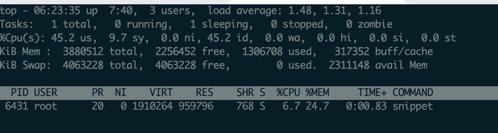
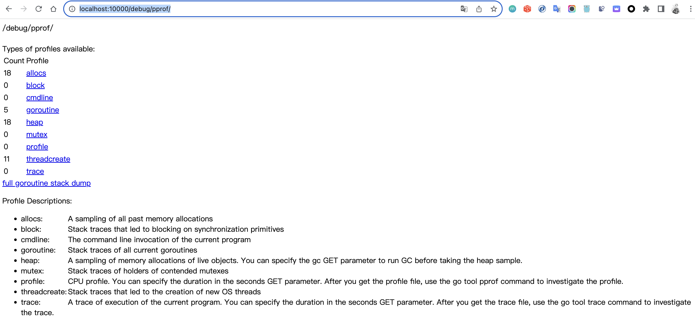
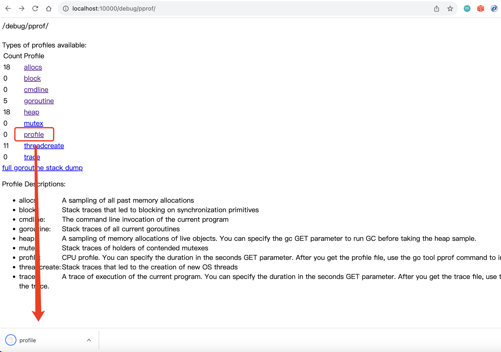
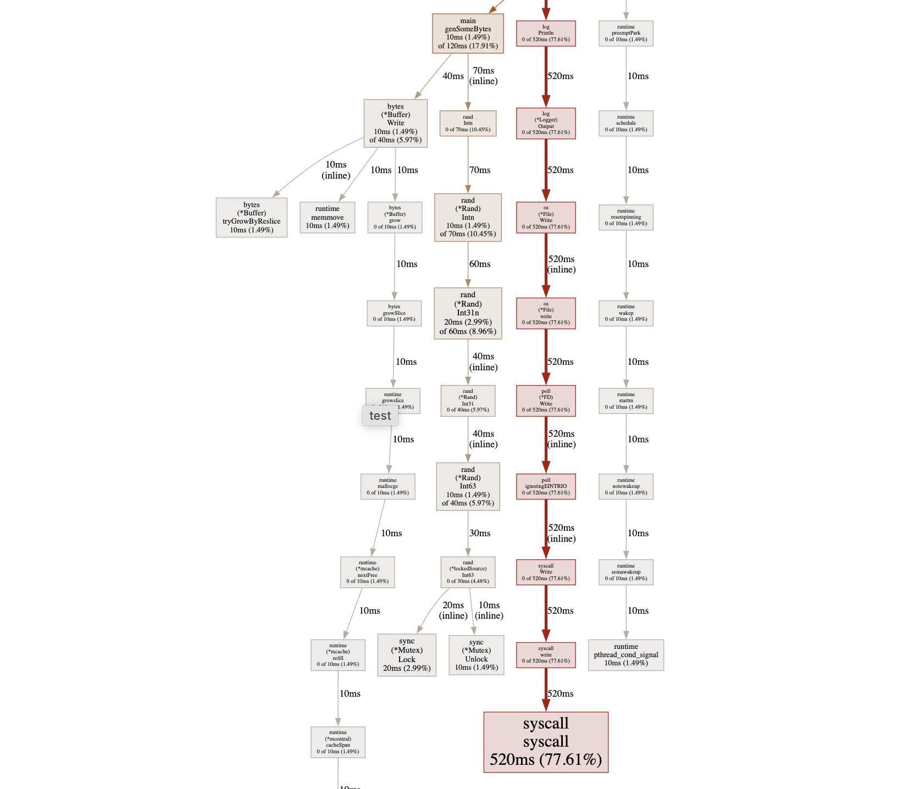

# Go 性能分析

## 1.分析程序的运行时间

### 1.1 time 指令

```go
package main

// go tool compile -m main.go // 查看逃逸情况
/*
   * @package main.go
   * @author：Will Yin <826895143@qq.com>
   * @copyright Copyright (C) 2023/7/17 Will

   main.go:8:6: can inline foo
   main.go:4:6: can inline main
   main.go:5:17: inlining call to foo
   main.go:10:3: moved to heap: foo1
*/
// go tool compile -S main.go > main.S // 查看汇编情况
// 查看 main.S 搜索 runtime.newobject(SB)
func main() {

	main_val := foo(666)
	println(*main_val, main_val)

	// 在给引用类型的引用成员进行赋值的时候可能发生逃逸Q AAQW2	5
	var (
		a = []interface{}{"fsdaf", "FASdf"}
	)
	a[0] = "fdasffsdaf"
	println(a)
}
func foo(a int) *int {
	var (
		foo1 = 11
		foo2 = 12
		foo3 = 13
	)
	for i := 0; i < 3; i++ {
		println(&a, &foo1, &foo2, &foo3)
	}
	return &foo1
}
```

```shell
$ time go run main.go

real    0m0.203s
user    0m0.055s
sys     0m0.060s
```

（1）real：从程序开始到结束,实际消耗的时间。

（2）user：程序在用户态消耗的时间。

（3）sys：程序在内核态消耗的时间。

real  >=  user + sys, 因为系统还有其他进程(切换其他进程期间对于本进程会有空白期）。

### 1.2 /usr/bin/time 指令

除了之前的信息外,还包括 CPU 占用率、内存使用情况、Page Fault 情况、进程切换情况、文件系统 1/0、Socket 使用情况等。

## 2. 分析 CPU 利用率

```go
package main

import (
	"log"
	"runtime"
	"time"
)

func test() {
	//slice 会动态扩容，用slice来做堆内存申请
	container := make([]int, 8)

	log.Println(" ===> loop begin.")
	for i := 0; i < 32*1000*1000; i++ {
		container = append(container, i)
	}
	log.Println(" ===> loop end.")
}

func main() {
	log.Println("Start.")

	test()

	log.Println("force gc.")
  
	//强制调用gc回收
	runtime.GC()

	log.Println("Done.")

	//睡眠，保持程序不退出
	time.Sleep(3600 * time.Second)
}
```

```shell
$ go build -o snippet main.go && ./snippet

$ top -p $(pidof snippet)
```



可以看到这里占用了接近 1G 的内存, 具体内容我们通过具体工具分析一下

### 2.1 runtime 库的 RedMemStats() 方法

测试代码:

```go
package main

import (
	"log"
	"runtime"
	"time"
)

func readMemStats() {

	var ms runtime.MemStats

	runtime.ReadMemStats(&ms)

	log.Printf(" ===> Alloc:%d(bytes) HeapIdle:%d(bytes) HeapReleased:%d(bytes)", ms.Alloc, ms.HeapIdle, ms.HeapReleased)
}

func test() {
	//slice 会动态扩容，用slice来做堆内存申请
	container := make([]int, 8)

	log.Println(" ===> loop begin.")
	for i := 0; i < 32*1000*1000; i++ {
		container = append(container, i)
		if i == 16*1000*1000 {
			readMemStats()
		}
	}

	log.Println(" ===> loop end.")
}

func main() {
	log.Println(" ===> [Start].")

	readMemStats()
	test()
	readMemStats()

	log.Println(" ===> [force gc].")

	//强制调用gc回收
	runtime.GC()

	log.Println(" ===> [Done].")
	readMemStats()

	go func() {
		for {
			readMemStats()
			time.Sleep(10 * time.Second)
		}
	}()
	//睡眠，保持程序不退出
	time.Sleep(3600 * time.Second)
}

```

这里主要调用runtime 中的 ReadMemStats() 「用内存分配器统计信息填充m」方法获得内在信息，然后通过 log  打印出来

````
// 这里解释下 runtime  包中，MemStats结构体用于存储内存统计信息。该结构体的字段含义如下：

1. Alloc：已分配的堆对象字节数。
2. TotalAlloc：从程序开始运行到现在分配的堆对象字节数，包括已释放的对象。
3. Sys：运行时系统使用的内存字节数，包括堆、栈和其他运行时数据结构。
4. Lookups：指针查找的次数。
5. Mallocs：分配的堆对象的次数。
6. Frees：释放的堆对象的次数。
7. HeapAlloc：堆上分配的对象字节数。
8. HeapSys：堆的总字节数。
9. HeapIdle：未被使用的堆内存字节数。
10. HeapInuse：正在使用的堆内存字节数。
11. HeapReleased：返回操作系统的堆内存字节数。
12. HeapObjects：堆上的对象数。
13. StackInuse：正在使用的栈内存字节数。
14. StackSys：栈的总字节数。
15. MSpanInuse：正在使用的mspan结构的字节数。
16. MSpanSys：mspan结构的总字节数。
17. MCacheInuse：正在使用的mcache结构的字节数。
18. MCacheSys：mcache结构的总字节数。
19. BuckHashSys：剖析器使用的字节数。
20. GCSys：垃圾回收元数据的字节数。
21. OtherSys：其他运行时系统使用的字节数。
22. NextGC：下一次垃圾回收的目标堆大小。
23. LastGC：上次垃圾回收的时间戳。
24. PauseTotalNs：垃圾回收暂停的总时间。
25. PauseNs：最近一次垃圾回收的暂停时间。
26. PauseEnd：最近一次垃圾回收的结束时间。
27. NumGC：垃圾回收的次数。
````

这些字段提供了有关程序内存使用情况和垃圾回收性能的详细信息。可以使用runtime.ReadMemStats函数来填充MemStats结构体。

```shell
$ go run main.go
2023/07/21 14:34:37  ===> [Start].
2023/07/21 14:34:37  ===> Alloc:113328(bytes) HeapIdle:3465216(bytes) HeapReleased:3432448(bytes)
2023/07/21 14:34:37  ===> loop begin.
2023/07/21 14:34:38  ===> Alloc:375879392(bytes) HeapIdle:114130944(bytes) HeapReleased:32964608(bytes)
2023/07/21 14:34:38  ===> loop end.
2023/07/21 14:34:38  ===> Alloc:122016(bytes) HeapIdle:682786816(bytes) HeapReleased:52436992(bytes)
2023/07/21 14:34:38  ===> [force gc].
2023/07/21 14:34:38  ===> [Done].
2023/07/21 14:34:38  ===> Alloc:123400(bytes) HeapIdle:682819584(bytes) HeapReleased:56369152(bytes)
2023/07/21 14:34:38  ===> Alloc:124232(bytes) HeapIdle:682786816(bytes) HeapReleased:59318272(bytes)
2023/07/21 14:34:48  ===> Alloc:124472(bytes) HeapIdle:682778624(bytes) HeapReleased:682729472(bytes)
2023/07/21 14:34:58  ===> Alloc:125056(bytes) HeapIdle:682811392(bytes) HeapReleased:682729472(bytes)
2023/07/21 14:35:08  ===> Alloc:125184(bytes) HeapIdle:682811392(bytes) HeapReleased:682729472(bytes)
// ....
```

## 3. 分析 CPU 性能情况

注意⚠️: 不使用虚拟机、共享的云主机，大多干扰因素会使分析数据很不一致

### 3.1 通过 Web 查看 profile 文件

```go
package main

import (
	"bytes"
	"log"
	"math/rand"
	"net/http"
	_ "net/http/pprof"
	"time"
)

func test() {

	log.Println(" ===> loop begin.")
	for i := 0; i < 1000; i++ {
		log.Println(genSomeBytes())
	}

	log.Println(" ===> loop end.")
}

//生成一个随机字符串
func genSomeBytes() *bytes.Buffer {

	var buff bytes.Buffer

	for i := 1; i < 20000; i++ {
		buff.Write([]byte{'0' + byte(rand.Intn(10))})
	}

	return &buff
}

func main() {

	go func() {
		for {
			test()
			time.Sleep(time.Second * 1)
		}
	}()

	//启动pprof
	http.ListenAndServe("0.0.0.0:10000", nil)

}
```

访问: http://localhost:10000/debug/pprof/



想得到 CPU 性能，就要获取当前进程的 profile 文什，这个文什默认为 30s生成一个, 所以程序至公要运行 30s 以上（这个参数也可以修改)才可以直接点击网页的 profile,  在浏览器上可以下裁这个 profile 文什。



### 3.2 使用 pprof 工具获取信息

pprof 的使用，命令格式如下： `go tool pprof [binary] [profile]`

- binary：必须指向生成这个性能分析数据的那个二进制可执行文件。
- profile：必领是该二进制可执行文件所生成的性能分析数据文件。

> binary 和 profile 必须严格匹配，即生成的 profile 文件的二进制可执行文件一定 go tool pprof 的第 1参数binary。(两者是父子关系)

先将刚才获取的  profile 文件放置在程序目录下,  先编译下程序, `go build -o test main.go`


```shell
$ go tool pprof ./test profile 
File: test
Type: cpu
Time: Jul 27, 2023 at 5:47pm (CST)
Duration: 30s, Total samples = 880ms ( 2.93%)
Entering interactive mode (type "help" for commands, "o" for options)
# 这里会出现一个“(pprof)”提示符，可以通过一些 pprof 内部指令和终端进行交互操作。help 指令可以査看其他一地指令，地可以通辻 top 指令来査看 CPU 的性能情況，最示的数据如下：
(pprof) top
Showing nodes accounting for 820ms, 93.18% of 880ms total
Showing top 10 nodes out of 78
      flat  flat%   sum%        cum   cum%
     590ms 67.05% 67.05%      590ms 67.05%  syscall.syscall
      70ms  7.95% 75.00%       70ms  7.95%  runtime.memmove
      50ms  5.68% 80.68%       50ms  5.68%  sync.(*Mutex).Lock (inline)
      40ms  4.55% 85.23%       40ms  4.55%  runtime.madvise
      20ms  2.27% 87.50%       20ms  2.27%  runtime.kevent
      10ms  1.14% 88.64%       10ms  1.14%  bytes.(*Buffer).tryGrowByReslice
      10ms  1.14% 89.77%       70ms  7.95%  math/rand.(*Rand).Int31n
      10ms  1.14% 90.91%       80ms  9.09%  math/rand.(*Rand).Intn
      10ms  1.14% 92.05%       60ms  6.82%  math/rand.(*lockedSource).Int63
      10ms  1.14% 93.18%       10ms  1.14%  runtime.gcTrigger.test
(pprof) 

```

- flat: 当前函数占用CPU 的耗时。
- flat%: 当前函数占用CPU 的耗时所占的百分比。
- sum%: 函数占用CPU 累计耗时所占的百分比。
- cum: 当前函数加调用当前函数的函数占用 CPU 的总耗时。
- cum%: 当前函数加调用当前函数的函数占用 CPU 的总耗时的百分比。

### 3.3 使用 pprof 文件获取信息

使用 pprof 工具获取信息(上一种方法), 弊端是 这个文什默认为 30s生成一个, 所以程序至公要运行 30s 以上, 那么想要获取更长时间的可能就没办法了

这边可以执行一下命令

```shell
$ go tool pprof http://localhost:10000/debug/pprof/profile?seconds=60
```

等待文件自动生成

```shell
$  go tool pprof http://localhost:10000/debug/pprof/profile?seconds=60
Fetching profile over HTTP from http://localhost:10000/debug/pprof/profile?seconds=60
# 这里的目录随便填写的(pprof 自动保存)
Saved profile in /usr/local/pprof/pprof.samples.cpu.001.pb.gz
Type: cpu
Time: Jul 27, 2023 at 6:07pm (CST)
Duration: 60s, Total samples = 2.36s ( 3.93%)
Entering interactive mode (type "help" for commands, "o" for options)
# 继续使用 top 命令监控
(pprof) top
Showing nodes accounting for 2.24s, 94.92% of 2.36s total
Dropped 32 nodes (cum <= 0.01s)
Showing top 10 nodes out of 51
      flat  flat%   sum%        cum   cum%
     1.80s 76.27% 76.27%      1.81s 76.69%  syscall.syscall
     0.12s  5.08% 81.36%      0.12s  5.08%  runtime.madvise
     0.07s  2.97% 84.32%      0.07s  2.97%  runtime.kevent
     0.05s  2.12% 86.44%      0.15s  6.36%  math/rand.(*Rand).Intn
     0.05s  2.12% 88.56%      0.05s  2.12%  runtime.memmove
     0.04s  1.69% 90.25%      0.04s  1.69%  runtime.pthread_cond_wait
     0.03s  1.27% 91.53%      0.07s  2.97%  bytes.(*Buffer).Write
     0.03s  1.27% 92.80%      0.03s  1.27%  sync.(*Mutex).Lock (inline)
     0.03s  1.27% 94.07%      0.03s  1.27%  sync.(*Mutex).Unlock (inline)
     0.02s  0.85% 94.92%      0.04s  1.69%  runtime.gcDrain
(pprof)
```

### 3.4 使用可视化工具分析


```shell
$  go tool pprof ./test 
./test: parsing profile: unrecognized profile format
failed to fetch any source profiles
WillYin:test yinchengxin$ go tool pprof ./test profile 
File: test
Type: cpu
Time: Jul 27, 2023 at 6:49pm (CST)
Duration: 30s, Total samples = 670ms ( 2.23%)
Entering interactive mode (type "help" for commands, "o" for options)
# 这里使用 web 命令调用工具
(pprof) web
failed to execute dot. Is Graphviz installed? Error: exec: "dot": executable file not found in $PATH
```

发现这里报错, 说明可视化工具没有安装, 

- Ubuntu 安装：`sudo apt-get install graphviz`

- Mac 安装：`brew install graphviz`

```shell
$ brew install graphviz


$ go tool pprof ./test profile
File: test
Type: cpu
Time: Jul 27, 2023 at 6:49pm (CST)
Duration: 30s, Total samples = 670ms ( 2.23%)
Entering interactive mode (type "help" for commands, "o" for options)
(pprof) web
```



这样比较清晰看出了函数之间的调用关系, 方块越大表示占用的 CPU 越大, 这样就可以有针对性的对程序进行优化


