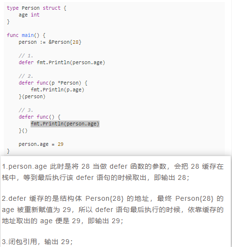
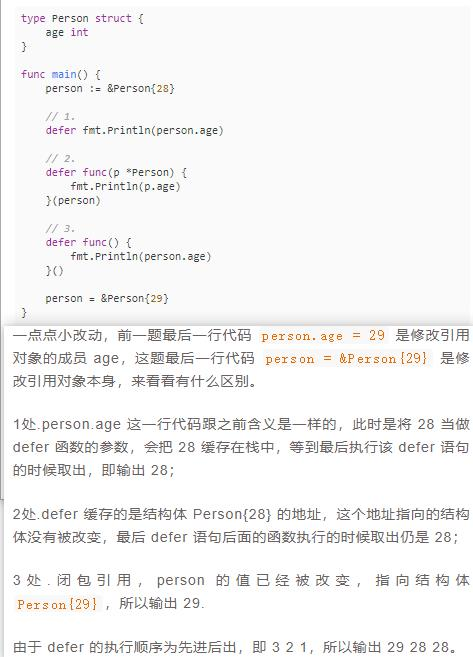
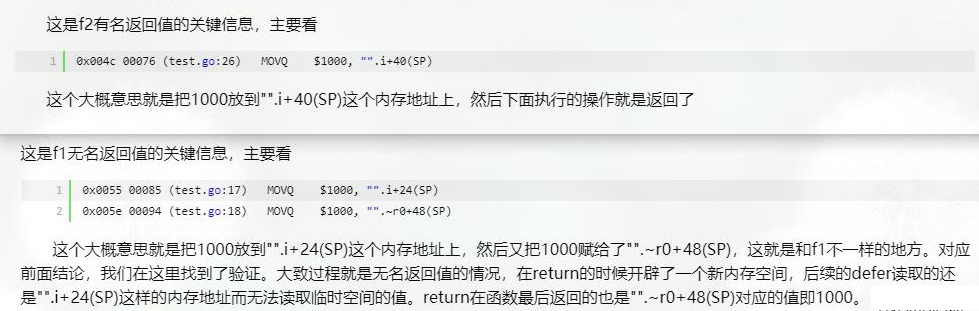

# defer 细节
## 1.什么是defer
defer 是 Go 语言提供的一种用于注册延迟调用的机制，每一次 defer 都会把函数压入栈中，当前函数返回前再把延迟函数取出并执行

-  `defer 语句并不会马上执行，而是会进入一个栈`，函数 return 前，会按先进后出（FILO）的顺序执行。也就是说最先被定义的 defer 语句最后执行。
- `先进后出的原因是后面定义的函数可能会依赖前面的资源，自然要先执行；否则，如果前面先执行，那后面函数的依赖就没有了。`

 defer 最容易采坑的地方是和`带命名返回参数的函数`一起使用时

- defer 语句定义时，对外部变量的引用是有两种方式的，分别是`作为函数参数`和`作为闭包引用`。
- 作为函数参数，则在 defer 定义时就把值传递给 defer，并被缓存起来；
- 作为闭包引用的话，则会在 defer 函数真正调用时根据整个上下文确定当前的值。
## 2.题目解析
### 2.1 题目:
#### 题目一
```go
func f1() (r int) {
    defer func() {
        r++
    }()
    return 0
}
````
#### 题目二
```go
func f2() (r int) {
    t := 5
    defer func() {
        t = t + 5
    }()
    return t
}
````
#### 题目三
```go
func f3() (r int) {
    defer func (r int) {
        r = r + 5
    }(r)
    return 1
}
````
#### 题目四
```go
func increaseA() int {
    var i int 
    defer func() {
        i++
    }()
    return 1
}
````
#### 题目五
```go
func increaseB() (r int) {
    defer func() {
        r++
    }()
    return r
}
````
### 2.2 解析
#### 题目一
```go
func f1() (r int) {

    // 1.赋值
    (r = 0)

    // 2.闭包引用，返回值被修改
    defer func() {
        r++
    }()

    // 3.空的 return
    return r
}

结果: 1
````
#### 题目二
```go
func f2() (r int) {
    t := 5
    // 1.赋值
    (r = t)

    // 2.闭包引用，但是没有修改返回值 r
    defer func() {
        t = t + 5
        fmt.Println(r) // 5
    }()

    // 3.空的 return
    return t
}

结果: 5
````
#### 题目三
```go
func f3() (r int) {

    // 1.赋值
    (r = 1)

    // 2.r 作为函数参数，不会修改要返回的那个 r 值
    defer func(r int) {
        r = r + 5
    }(r)

    // 3.空的 return
    return 1
}

解析: 第二步，r 是作为函数参数使用，是一份复制，defer 语句里面的 r 和 外面的 r 其实是两个变量，
里面变量的改变不会影响外层变量 r，所以不是返回 6 ，而是返回 1。

结果: 1
````
#### 题目四
大家可能注意到，函数 increaseA() 是匿名返回值，返回局部变量，同时 defer 函数也会操作这个局部变量。
对于匿名返回值来说，可以假定有一个变量存储返回值，比如假定返回值变量为 anony，上面的返回语句可以拆分成以下过程：
````
annoy = i
i++
return
````
由于 i 是整型，会将值拷贝给 anony，所以 defer 语句中修改 i 值，对函数返回值不造成影响，所以返回 0 。
#### 题目五
```go
func increaseB() (r int) {

    // 1.赋值
    r = 0

    // 2.闭包引用，r++
    defer func() {
        r++
    }()

    // 3.空 return
    return 
}

结果: 1
````



## 3.练习
```go
func f1() int {
	t := 5
	defer func() {
		fmt.Println(t)
		t = t + 5
		fmt.Println(t)
	}()
	fmt.Println(t,23)
	return t
}
func f2() (t int) {
	t = 5
	defer func() {
		t = t + 5
	}()
	return t
}
func f3() (r int) {
	t := 5
	defer func() {
		fmt.Printf("r:%p,t:%p",&r,&t)
		t = t + 5
	}()
	return t
}
func f4() (r int) {
	t := 5
	fmt.Printf("t:%p",&r)
	fmt.Println()
	defer func() {
		fmt.Printf("t:%p",&r)
		fmt.Println()
		t = t + 5
		fmt.Printf("t:%p",&r)
		fmt.Println()
	}()
	return r
}
func f5() (r int) {
	defer func (r int) {
		r = r + 5
	}(r)
	return 1
}
func f6() (r int) {
	r = 1
	fmt.Printf("r:%p",&r)
	fmt.Println()
	defer func (r int) {
		fmt.Printf("r:%p",&r)
		fmt.Println()
		r = r + 5
		fmt.Printf("r:%p",&r)
		fmt.Println()
	}(r)
	return
}
func f7() (r int) {
	r = 1
	defer func (r int) {
		r = r + 5
	}(r)
	return 2
}
func f8() (r int) {
	r = 1
	defer func () {
		r = r + 5
		return
	}()
	return 2
}
func main() {
	fmt.Println(f1()) // 5
	fmt.Println(f2()) // 10
	fmt.Println(f3()) // 5
	fmt.Println(f4()) // 0
	fmt.Println(f5()) // 1
	fmt.Println(f6()) // 1
	fmt.Println(f7()) // 2
	fmt.Println(f8()) // 7
}

结果:
5 23
5
10
5
10
r:0xc00000a0a8,t:0xc00000a0c05
t:0xc00000a0c8
t:0xc00000a0c8
t:0xc00000a0c8
0
1
r:0xc00000a0e0
r:0xc00000a0e8
r:0xc00000a0e8
1
2
7
````
```go
func main()  {
	fmt.Println("f1 result: ", f1())
	fmt.Println("f2 result: ", f2())
}

func f1() int {
	var i int
	fmt.Printf("i: %p \n", &i)
	defer func() {
		i++
		fmt.Printf("i: %p \n", &i)
		fmt.Println("f11: ", i)
	}()

	defer func() {
		i++
		fmt.Printf("i: %p \n", &i)
		fmt.Println("f12: ", i)
	}()

	i = 1000
	return i
}

func f2() (i int) {
	fmt.Printf("i: %p \n", &i)
	defer func() {
		i++
		fmt.Printf("i: %p \n", &i)
		fmt.Println("f21: ", i)
	}()

	defer func() {
		i++
		fmt.Printf("i: %p \n", &i)
		fmt.Println("f22: ", i)
	}()
	i = 1000
	return i
}


结果:
i: 0xc00000a0a0 
i: 0xc00000a0a0 
f12:  1001
i: 0xc00000a0a0 
f11:  1002
f1 result:  1000
i: 0xc00000a0e8 
i: 0xc00000a0e8 
f22:  1001
i: 0xc00000a0e8 
f21:  1002
f2 result:  1002
````
f1函数：

- 进入该函数，因为没有指定返回值变量，需要先声明i变量，因为是int类型，如果没有赋值，该变量初始化值为0，之后执行i=1000的赋值操作，然后执行return语句，返回i的值。
- 真正返回之前还要执行defer函数部分，两个defer函数分别针对i进行自增操作，i的值依次为1001和1002

f2函数：

- 进入该函数，因为已经定义好了返回值变量即为i，然后直接赋值i=1000，再返回i的值。
- 同样的，也要在真正返回i前，执行两个defer函数，同样i依次自增得到1001和1002。

#### 问题的关键是为什么匿名参数返回的值是1000，其并未收到defer函数对于i自增的影响；而有名函数在执行defer后，最后返回的i值为1002
````
原因就是return会将返回值先保存起来，对于无名返回值来说，保存在一个临时对象中，defer是看不到这个临时对象的；
而对于有名返回值来说，就保存在已命名的变量中。
````
#### 从这个结果可以看出，无论是f1还是f2函数中，变量i的地址全程没有改变过。

对于上面这个结论还有一个问题,return保存在一个临时对象中，defer看不到这个临时变量，但是i的值为什么能够在1000的基础上累加呢

通过命令将go语言转为汇编语言

