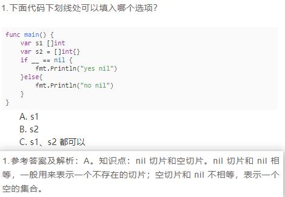
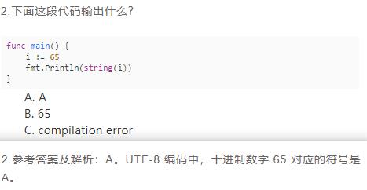

```go
//func main() {
//	// 数组进行参数传递时无法修改数组,想要想改数组只有传递数组指针才行,而切片却实现了数组的改变!
//	// slice 的内部实现中有三个变量,指针 ptr,个数 len 和容量 cap ,其中 ptr 指向真正的数据存储地址.
//
//	// 切片当作值传递给函数时 切片的地址是新的 指向的底层数组是相同的 但是append函数对切片进行操作时 会给底层
//	// 数组从新分配内存 此时切片就与原来的切片完全无关
//	a := []int{7,8,9}
//	//  %v	值的默认格式表示
//	//  %+v	类似%v，但输出结构体时会添加字段名
//	//  %#v	值的Go语法表示
//	//  %T	打印值的类型
//	//  %%	百分号
//	fmt.Printf("%+v", a) // [7 8 9]
//	ap(a)
//	fmt.Printf("%+v", a) // [7 8 9]
//	app(a)
//	fmt.Printf("%+v", a) // [1 8 9]
//}
//
//func ap(a []int) {
//	a = append(a, 10)
//}
////func ap(a []int) []int  {
////	return append(a, 10)
////}
//
//func app(a []int) {
//	// 字段覆盖
//	a[0] = 1
//}


//func main()  {
//	// byte(uint8) , rune(int32)
//	b := []byte{'h', 104, 101}	//注意单引号
//	u8 := []uint8{'h', 104, 101}
//	fmt.Printf("%T %T\n", b, u8) //[]uint8 []uint8
//	fmt.Println(string(b), string(u8)) // hhe hhe
//
//	str2 := "hello中国"
//	data2 := []rune(str2) //类型转换
//	fmt.Println(data2)    //[104 101 108 108 111 228 184 173 229 155 189]
//
//	str2 = string(data2)
//	fmt.Println(str2) //hello中国
//}


//const (
//    x = iota // 0
//    _ // 1
//    y // 2
//    z = "zz" // zz
//    k // zz
//    p = iota // 5
//)
//
//func main()  {
// fmt.Println(x,y,z,k,p)
//}

//var x interface{} = nil
//var x error = nil
//func main() {
//	fmt.Println(x)
//}

// 关于init 1)一个包中可以有多个init 2)程序编译的时候,先执行依赖包中的init 再执行main包中的init
//func init() {
//	fmt.Println("this is one inti")
//}
//func init() {
//	fmt.Println("this is two inti")
//}
//func hello() []string {
//	return nil
//}
//func main() {
//	// hello 和 hello() 区别
//	a := hello
//	if a == nil {
//		fmt.Println("nil")
//		return
//	}
//	fmt.Println("not nil")
//
//	h := hello();
//	if h == nil {
//		fmt.Println("nil")
//	    return
//	}
//	fmt.Println("not nil")
//}


//func valueType() int {
//	return 1
//}
//
//type Student struct {
//	name string
//	id int64
//}
// cannot type switch on non-interface value i (type int)
//func main() {
	// 类型选择语法: i.(type) 其中i为接口 type是固定字段 只有接口类型才可以使用类型选择
	//a := valueType() // 1
	//switch i.(type) {
	//case int:
	//	println("int")
	//case string:
	//	println("string")
	//case interface{}:
	//	println("interface")
	//}

	//i := make([]interface{}, 3)
	//i[0] = 1                    //int
	//i[1] = "hello go"           //string
	//i[2] = Student{"mike", 666} //Student
	////类型查询，类型断言
	//for index, data := range i {
	//	fmt.Println(data)
	//	switch value := data.(type) {
	//	case int:
	//		fmt.Printf("i[%d] 类型为int, 内容为%d\n", index, value)
	//	case string:
	//		fmt.Printf("i[%d] 类型为string, 内容为%s\n", index, value)
	//	case Student:
	//		fmt.Printf("i[%d] 类型为Student, 内容为name = %s, id = %d\n", index, value.name, value.id)
	//	}
	//}
//}

// 关于channel
// 1)声明channel方式 var ch chan int 或者 ch := make(chan int)
// 2) <- ch        输出
// 3) ch <- value  输入


// 打印一个map中不存在的值返回元素类型的0值
//type person struct {
//	name string
//}
//func main() {
//	var m map[person]int
//	p := person{"will"}
//	fmt.Println(m[p]) // 0
//}


// 如果函数的最后一个参数使用 ... 前缀进行修饰，那这个函数就可以接收任意长度的参数 — 这个函数也被称为可变函数
// 对于一个函数，只有最后一个参数才能是可变的
// append函数 就是一个可变函数

// 可变函数
//func hello(num ...int) {
//	fmt.Println(num)
//	fmt.Printf("type of nums is %T\n", num)
//	num[0] = 18
//}
//func main() {
//	test := []int{1,2,3}
//	hello(3,4,5)
//	hello(test ...)
//	fmt.Println(test[0]) //18
//}


//func main() {
//	a := 13
//	b := 13.3
//	fmt.Println(a+b) // Compilation finished with exit code 2
//}


//截取操作符还可以有第三个参数，形如[i，j，k]，第三个参数k用来限制新切片的容量，但不能超过原数组（切片）的底层数组大小。
//截取获得的切片的长度和容量分别是：j-i、k-i。
//func main() {
//	//a := [6]int{1,2,3,4,5,6}
//	a := [5]int{1,2,3,4,5}
//	b := a[3:4:5]
//	fmt.Println(b[0],len(b),b) // 4 1 [4]
//}


// go中数组是值类型,可以进行比较,长度也是数组类型的组成部分,所以编译错误
//func main() {
//	a := [2]int{1,2}
//	b := [3]int{1,2}
//	if a == b {
//		fmt.Println("equal")
//		return
//	}
//	fmt.Println("not equal")
//}


// num 为 int 类型指针 指向的是main中的p变量 然后执行自增操作 incr返回自增后的结果
//func incr(num *int) int {
//	*num++
//	return *num
//}
//func main() {
//	num := 1
//	incr(&num)
//	fmt.Println(num) // 2
//	fmt.Println(string(65)) // A
//}


//type S interface {
//	A() int64
//}
//
//type SS interface {
//	B() int64
//}
//
//type work struct {
//	num int64
//}
//
//func (w work) A()int64 {
//	return w.num + 10
//}
//
//func (w work) B()int64 {
//	return w.num + 20
//}
//
//func main() {
//	a := work{3}
//	var s S = a
//	var ss SS = a
//	fmt.Println(s.A()) // 13
//	fmt.Println(ss.B()) // 23
//}
````