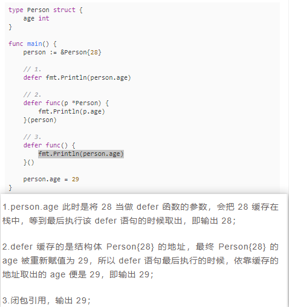
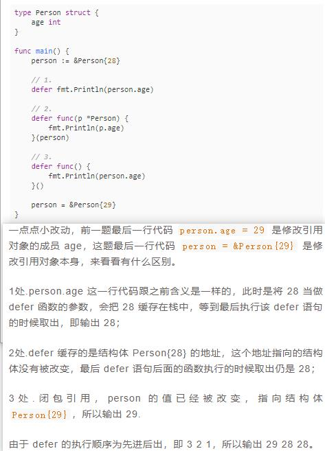
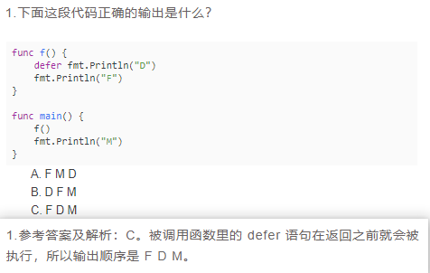
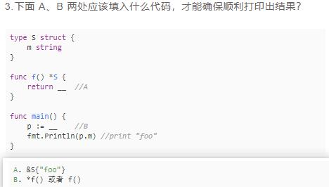
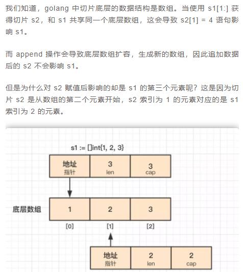
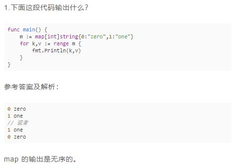
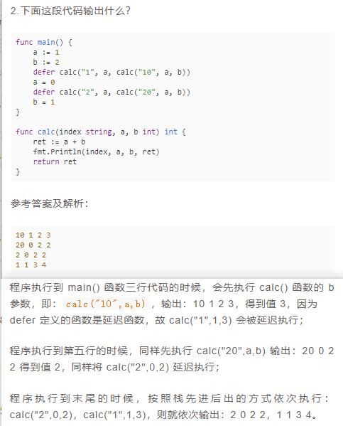
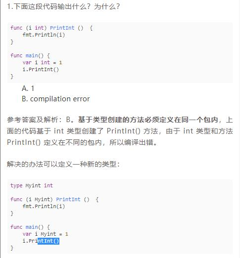
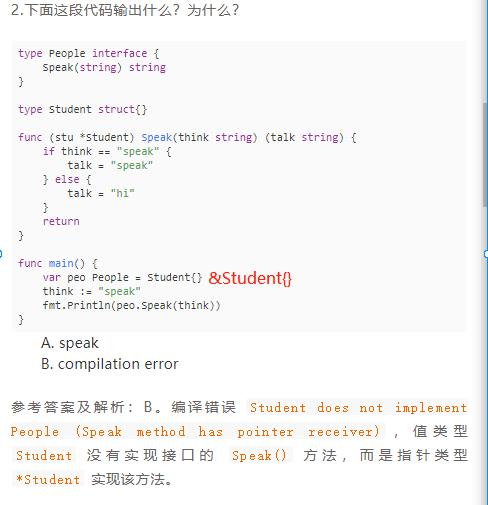

# 试题-2




```go
package main

import "fmt"

type Person struct {
	age int64
}
func main() {
	person := &Person{18}
	fmt.Printf("%p", person) // 0xc00000a0a0
	fmt.Println()

	defer fmt.Println(person.age) // 18

	defer func(p *Person) {
		fmt.Println(p.age) // 18
	}(person)

	defer func(){
		fmt.Println(person.age) // 19
	}()

	person = &Person{19}
	fmt.Printf("%p", person) // 0xc00000a0a8
	fmt.Println()
}

//func main() {
//	person := &Person{18}
//	fmt.Printf("%p", person) // 0xc00000a0a0
//	fmt.Println()
//
//	defer fmt.Println(person.age) // 18
//
//	defer func(p *Person) {
//		fmt.Println(p.age) // 19
//	}(person)
//
//	defer func(){
//		fmt.Println(person.age) // 19
//	}()
//
//	person.age = 19
//	fmt.Printf("%p", person) // 0xc00000a0a0
//	fmt.Println()
//}
````






```go
func main() {

	s1 := []int{1, 2, 3}
	s2 := s1[1:]
	s2[1] = 4
	fmt.Println(s1) // [1 2 4]
	s2 = append(s2, 5, 6, 7)
	fmt.Println(s1) // [1 2 4]
	fmt.Println(s2) // [2 4 5 6 7]
}
````










```go
type People interface {
	Speak(in string) (outs string)
}

type Person struct {}

func (p *Person)Speak(in string) (out string)  {
	if in == "speak" {
		out = "speak"
	} else {
		out = "talk"
	}
	return
}

func main() {
	//will := &Person{}
	var will People = &Person{}
	fmt.Println(will.Speak("speak"))
}
````
