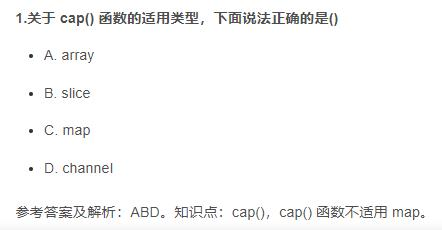
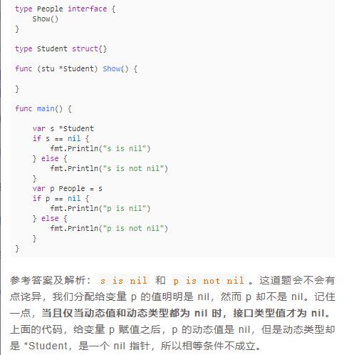

# 试题3
> ### 第一题
```go
const (
	a = iota
	b = iota
)
const (
	name = "name"
	c    = iota
	d    = iota
)
func main() {
	fmt.Println(a) // 0
	fmt.Println(b) // 1
 	fmt.Println(c) // 1
	fmt.Println(d) // 2
}

参考链接: https://studygolang.com/articles/2192
````
> ### 第二题


> ### 第三题 
值为nil的接口不是nil接口
```go
func f(w io.Writer) {
	if w == nil {
		fmt.Println("nil")
	}
	fmt.Println("not nil")
}

func main() {
	var b *bytes.Buffer
	f(b)
}
````
在main中显然b的值为nil，按照正常的思维逻辑，最后应该会打印nil，然而结果是not nil。

为什么会这样？我们能看到f的参数为接口，显然b是满足该接口的，在golang中接口由两部分组成：`动态类型`和`动态值`，这里显然动态类型是*bytes.Buffer，动态值是nil。在判断时w != nil，也就是说，值为nil的接口不是nil接口。

空类型的几种形式
- 空指针：var a *int
- 空列表：var a []int
- 空字典：var a map[string] int
- 空队列：var a chan int
- 空函数：var a func(string) int
- 空接口：var a error(var i interface{}) // error 是接口

```go
var i interface{}
var I error

func main() {
    if i == nil {
        fmt.Println("i is nil")
    } else {
        fmt.Println("i is not nil")
    }

    if i == I {
        fmt.Println("I is nil")
    } else {
        fmt.Println("I is not nil")
    }
}

//结果:i is nil
//I is nil
````

最后如果将f的参数改为b *bytes.Buffer的话，最后就能看到打印nil了。
```go
func f(b *bytes.Buffer) {
    if b == nil {
        fmt.Println("nil")
    }
    fmt.Println("not nil")
}

func main() {
    var b *bytes.Buffer
    f(b)
}
````


- interface{}只有在动态类型和动态值同时为nil的前提下才为nil。
- 若类型转换之后，interface{}的动态类型不为nil，则其不为nil。

> ### 第四题
```go
import "fmt"

type Direction int

const (
	east Direction = iota
	west
	south
	north
)

func (d Direction)string() string {
	return [...]string{"east", "west", "south", "north"}[d]
}

func main() {
	fmt.Println(south) // 2
	fmt.Println(south.string()) // south
}
````
> ### 第五题
```go
type Math struct {
	x, y int
}

var m = map[string]*Math{
	"foo": &Math{2, 3},
}

//func main() {
//	// 对于类似 X = Y的赋值操作，必须知道 X 的地址，才能够将 Y 的值赋给 X，但 go 中的 map 的 value 本身是不可寻址的
//	m["foo"].x = 4 // 这里会报错 cannot assign to struct field m["foo"].x in map
//	fmt.Println(m["foo"].x)
//}

func main() {
	m["foo"].x = 4
	fmt.Println(m["foo"].x)
	fmt.Printf("%#v", m["foo"])
}
````