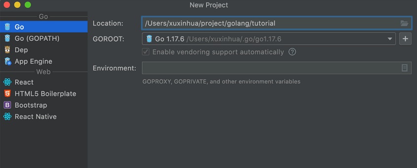
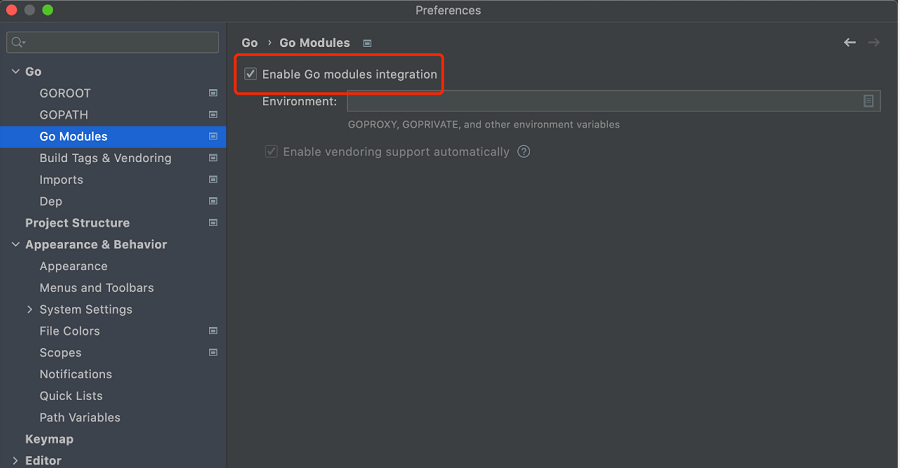

## 常规安装
#### 安装包地址
到 [Go 中文网](https://studygolang.com/dl) 或者到 [官网](https://go.dev/dl/) 下载对应的安装包。

如果你是 M1 之后的 Mac，下载 go1.17.6.darwin-arm64.pkg，否则下载 go1.17.6.darwin-amd64.pkg。之后双击下载的安装包，按提示一步步操作即可
````
Windows 安装方式类似，一步步操作即可。
Linux 下，需要解压压缩包，然后将解压后的文件夹移动到 /usr/local/ 目录下。
````

#### 配置环境变量
默认情况下，经过以上操作，Go 安装在了 /usr/local/go 中，可以通过以下命令验证是否安装成功：
```shell
$ /usr/local/go/bin/go version
go version go1.17.6 darwin/amd64
````
如果能正常输出版本信息，表示安装成功了。

我没有配置任何环境变量。实际上，Go 默认已经不需要配置任何环境变量了 —— 什么 `GOROOT`、`GOPATH` 等都不需要了
但有一个环境变量需要配置下，那就是 PATH，否则每次都需要指定 /usr/local/go/bin/go 这么长的路径

[mac](http://t.zoukankan.com/liuzhixian666-p-13829367.html) 下打开 ~/.bash_profile，在文末加上以下内容：

```shell
export PATH=$PATH:/usr/local/go/bin
````
然后执行：
```shell
$ source  ~/.bash_profile
````
这时在终端直接输入 go verison：
```shell
$ go version
go version go1.17.6 darwin/amd64
````
这就是 PATH 环境变量的作用。
````
Linux 下配置和 Mac 类似。
Windows 下请查阅配置 PATH 环境变量的方法。
````
#### 不过，国内特殊的环境，我们还需要做一个重要的配置，那就是 GOPROXY：
```shell
$ go env -w GOPROXY=https://goproxy.cn,https://goproxy.io,direct
````
这样可以方便地下载 golang.org/x 等包，所以，记得执行以上命令

#### 开始 go mod 模式:
````
go env -w GO111MODULE=on
go env -u GO111MODULE // 取消env配置项
````
#### 设置 go path
创建目录
````
mkdir /usr/local/go/path
````
````
go env -w GOPATH="/usr/local/go/path"
````
打开 ~/.bash_profile，在文末加上以下内容：
```shell
export PATH=$PATH:/usr/local/go/path/bin
````
然后执行：
```shell
$ source  ~/.bash_profile
````
#### 配置内网 module
````
go env -w GOPRIVATE=gitlab.tech.*****.com

// 编辑 .gitconfig 文件, 添加内容
[url "git@gitlab.tech.****.com:"]
     insteadOf = https://gitlab.tech.****.com/
````
#### 问题: SECURITY ERROR go.sum database server misbehavior detected! 
````
SECURITY ERROR
go. sum database server misbehavior detected! 

old database:
	go. sum database tree
	3846441
	yTdBGkYGOrG40MBW83jwB8H5bDUyoYteDewEbw1IZ+k=
	-Sun.oolang. org AZ3grvrGt6ndnfN6IGvZbBXD8uLb4aodhyfT5U9T+thpOBviFDu5P3b/
	fmXOoOY6GfwPsKdP33ngLk9XCPJnTYRBFQU=

new database:
	go. sum database tree
	3905315
	NEPSVZMUn+b53ONFAHAOM9Q9TFUSrEVUnMJa3+Z2f10-
	sum.golang.org Az3grkbZ0SJelrKBSLTysf1yTzd75812d+93vxfSQE/JBNLFwpmPHuk1KLHcdL5jOtFx/
	aKgpqnkceaG5HVjMOoG408=
	
proof of misbehavior:
	YwiZoPOTKIGRZFPesksymEkXteiKa2LLQWUSZOIey70=
	internal error: generated inconsistent proof
		
````
原因:
> 查询大量的资料后，确定的问题所在，go mod 在下载包的时候会检查你下载的包与go官方维护的包的一致性和完整性。go mod 检查Hash一致使用的地址是go环境变量 GOSUMDB 的地址，这个值默认是 sum.golang.org，这个地址在国内目前肯定是被墙了的。

解决办法:
- 关闭go mod的hash检查: 将环境变量 GOSUMDB 的值设为off，`go env -w GOSUMDB=off` 即可关闭go mod的包hash检查功能，就能够随便下载了。这个方法是100%最快捷的方法 GOSUMDB
- 修改GOSUMDB: 将环境变量 GOSUMDB 的值设为其它国内的地址，目前我使用的是 `go env -w GOSUMDB=sum.golang.google.cn`
## Goland 安装
我们点击 New Project，创建一个新项目：



一定要选择第一项，而不是 Go（GOPATH），Location 可以选择你喜欢的位置，GOROOT 就是你 Go 安装的位置，GoLand 会自动检测到。
创建后，会创建好项目，里面会有一个 go.mod 文件。这是 Go Module 的依赖管理文件。创建一个文件 main.go，输入以下内容：
```go
package main

import "fmt"

func main() {
	fmt.Println("Hello, 2022!")
}
````
GoLand 默认会自动保存。然后点击运行按钮运行：

对于已经存在的项目，如果发现代码提示、依赖等有问题，打开 GoLand 的「Preferences」，确认有无勾选 Module：



---
## Dockerfile
````
-------------------------------------- 目录结构 ------------------------------------
- Dockerfile
- main.go
- go.mod
- go.sum
-------------------------------------- Dockerfile ------------------------------------
FROM  golang:1.15-alpine as builder

# 启用 Go Modules 功能 go 设置国内源
RUN go env -w GO111MODULE=on \
    && go env -w GOSUMDB=off \
    && go env -w GOPROXY=https://mirrors.aliyun.com/goproxy/,direct

# cd 到 /workspace 里面
WORKDIR /workspace

# 复制文件(目录)
COPY main.go/ main.go/
COPY go.mod go.mod
COPY go.sum go.sum

# 执行 go build   从./cmd/user/server.go  输出到 ./app 可执行文件
# 最终 app 可执行文件 路径 为  /workspace/app
RUN CGO_ENABLED=0   go build -a -o app ./main.go

EXPOSE 8050


# 多段编译
FROM  alpine

# 修改时区
RUN ln -sf /usr/share/zoneinfo/Asia/Shanghai /etc/localtime && \
    echo "Asia/Shanghai" > /etc/timezone
    
# cd 到 / 目录
WORKDIR /

# 把builder 阶段 的 成功 /workspace/app 可执行文件 复制到 当前目录来 (/workspace)
COPY --from=builder /workspace/app .

## 暴露容器端口 8050
EXPOSE 8050

#执行  /app 命令  运行 app 启动服务
ENTRYPOINT ["/app"]
#CMD ["/one"]

-------------------------------------- main.go------------------------------------
package main

import "github.com/gin-gonic/gin"

func main() {
	r := gin.Default()
	gin.SetMode("test")
	r.GET("/hello", func(c *gin.Context) {
		c.JSON(200, gin.H{
			"message": "Hello this is 8050",
		})
	})
	r.Run(":8050") // listen and serve on 0.0.0.0:8080
}
-------------------------------------- command ------------------------------------
docker build -t app .
docker run -itd -p 8050:8050 --name myApp app
docker exec -it  b54b59d99388  sh

访问: http://172.16.252.99:8050/hello
	{
		"message": "Hello this is 8050"
	}
````
### dockerfile -- 抛砖引玉
简略版
````
FROM golang:alpine

WORKDIR /build

COPY hello.go .

RUN go build -o hello hello.go

CMD ["./hello"]
````
构建镜像：`docker build -t hello:v1 .`

查看一下:
````
$ docker run -it --rm hello:v1 ls -l /build
total 1260
-rwxr-xr-x    1 root     root       1281547 Mar  6 15:54 hello
-rw-r--r--    1 root     root            55 Mar  6 14:59 hello.go

$ docker images | grep hello
hello   v1    2783ee221014   44 minutes ago   314MB
````
镜像有点大, 主要原因是在于 `WORKDIR /build` 这一步

从新更改镜像
````
FROM alpine

WORKDIR /build

COPY hello .

CMD ["./hello"]
````
跑一下试试
````
$ docker build -t hello:v2 .
...
=> ERROR [3/3] COPY hello .                         0.0s
------
 > [3/3] COPY hello .:
------
failed to compute cache key: "/hello" not found: not found
````
忘记先编译一下 hello.go 了
````
$ go build -o hello hello.go
````
````
$ docker run -it --rm hello:v2
standard_init_linux.go:228: exec user process caused: exec format error
````
我们开发机不是 linux
````
$ GOOS=linux go build -o hello hello.go
````
````
$ docker run -it --rm hello:v2
hello world!

$ docker run -it --rm hello:v2 ls -l /build
total 1252
-rwxr-xr-x    1 root     root       1281587 Mar  6 16:18 hello
````
````
$ docker images | grep hello
hello    v2   0dd53f016c93   53 seconds ago      6.61MB  // 可以说很 nice 了
hello    v1   ac0e37173b85   25 minutes ago      314MB
````
在流行什么多阶段构建，那么第二种方式到底有啥问题呢？细细琢磨之后发现，我们要能从 Go 代码构建出 docker 镜像，其中分为三步：
- 本机编译 Go 代码，如果牵涉到 cgo 跨平台编译就会比较麻烦了
- 用编译出的可执行文件构建 docker 镜像
- 编写 shell 脚本或者 makefile 让这几步通过一个命令可以获得

来一版
````
FROM golang:alpine AS builder

WORKDIR /build

ADD go.mod .
COPY . .
RUN go build -o hello hello.go


FROM alpine

WORKDIR /build
COPY --from=builder /build/hello /build/hello

CMD ["./hello"]
````
````
$ docker run -it --rm hello:v3
hello world!

$ docker images | grep hello
hello    v3     f51e1116be11   8 hours ago    6.61MB
hello    v2     0dd53f016c93   8 hours ago    6.61MB
hello    v1     ac0e37173b85   8 hours ago    314MB
````
神功练成!!!!

----
## Centos(docker)
````
centos 安装:
docker pull centos:7
docker run -itd -p 7010:22 -p 7020:80  --name myCentos centos:7

安装ssh:
    yum install openssh* -y
    yum install wget -y
    yum install initscripts -y
    yum install net-tools -y  // netstat 是显示网络连接、路由表和网络接口信息
    
修改ssh配置(打开注释):
vi /etc/ssh/sshd_config

    Port 22
    ListenAddress 0.0.0.0
    ListenAddress ::

    PermitRootLogin yes

    PasswordAuthentication yes

开启ssh
    /etc/rc.d/init.d/sshd status|start

设置密码:
    passwd
------------------------------------- Go安装 -------------------------------------
1) 下载
    wget https://golang.google.cn/dl/go1.15.8.linux-amd64.tar.gz / wget https://golang.org/dl/go1.17.1.linux-amd64.tar.gz(需要翻墙)

2) 将下载的包解压到 /usr/local目录下
    tar -zxf go1.17.1.linux-amd64.tar.gz -C /usr/local


3) 环境变量添加
    mkdir /go
    chmod -R 777 /go
    vim /etc/profile

    export GO111MODULE=on
    export GOPROXY=https://goproxy.cn,direct
    export GOROOT=/usr/local/go
    export GOPATH=/go
    export PATH=$PATH:$GOROOT/bin:$GOPATH/bin

    source /etc/profile

4) 配置全局代理
    go env -w GOPROXY=https://goproxy.cn,direct
 
5) 卸载旧版本
    rm -rf /usr/local/go
------------------------------------- Docker安装 ------------------------------------- 
1) docker pull willyin/go-centos
2) docker run -itd -p 7010:22 -p 7020:80 -p 7030:8080 --name Go willyin/go-centos
3) 进入容器, 执行 source /etc/profile 和 service sshd start
````

----
## 命令
````
1) 查看指定配置项
    go env GONOPROXY
2) 以json格式查看数据
    go env -json
3) 设置env
    go env -w GO111MODULE=on
4) 取消env配置项
    go env -u GO111MODULE
````
Mac 下 docker 安装需指定平台 `docker run -itd --name centos --platform=linux/amd64 centos:centos7`


----
## protobuf 安装
#### rpc 服务需要 [protobuf](https://github.com/protocolbuffers/protobuf) 的支持, 这里在 Centos8 下进行安装(根据系统选择合适版本 uname -a)
````
wget https://github.com/protocolbuffers/protobuf/releases/download/v3.19.4/protoc-3.19.4-linux-aarch_64.zip

unzip protoc-3.19.4-linux-aarch_64.zip
 
mv ./bin/protoc /usr/local/bin/

// 验证
[root@99 ~]# protoc
````
#### 生成rpc代码需要安装 `protoc-gen-go` 和 `protoc-gen-go-grpc`
```` 
go install google.golang.org/protobuf/cmd/protoc-gen-go@latest

go install google.golang.org/grpc/cmd/protoc-gen-go-grpc@latest


[root@99 ~]# ls /usr/local/go/path/bin/
goctl  protoc-gen-go  protoc-gen-go-grpc
````
如果出现报错, 从新安装 protoc-gen-go 即可 `go get -u github.com/golang/protobuf/protoc-gen-go`

#### 生成并使用
````
# https://developers.google.com/protocol-buffers/docs/gotutorial

syntax="proto3";
package pb;

//  option go_package = "path;name";
//  - path 表示生成的go文件的存放地址，会自动生成目录的。
//  - name 表示生成的go文件所属的包名
option go_package = "/internal/service;service";


// 手动安装一下 protoc-go-inject-tag 库
// go get github.com/favadi/protoc-go-inject-tag
// 可以在proto文件中注入tag，然后在导出的时候相应的字段的tag就可以被修改掉, 否则使用默认 pb 的 tag
message UserModel {
  // @inject_tag: json:"user_id"
  uint32 UserID=1;
  // @inject_tag: json:"user_name"
  string UserName=2;
  // @inject_tag: json:"nick_name"
  string NickName=3;
}

// 在根目录下执行即可
protoc -I internal/service/pb    internal/service/pb/*.proto --go_out=.
protoc -I internal/service/pb    internal/service/pb/*.proto --go-grpc_out=.
````

#### 如需使用grpc-gateway，要安装 `protoc-gen-grpc-gateway` 和 `protoc-gen-openapiv2`
````
go install github.com/grpc-ecosystem/grpc-gateway/v2/protoc-gen-grpc-gateway@latest

go install github.com/grpc-ecosystem/grpc-gateway/v2/protoc-gen-openapiv2@latest
`````

--- 

## 常用命令
````
 Mac下编译Linux, Windows平台的64位可执行程序：
   CGO_ENABLED=0 GOOS=linux GOARCH=amd64 go build test.go -o vrpm
   CGO_ENABLED=0 GOOS=windows GOARCH=amd64 go build test.go -o vrpm
   
使用它就像-race在普通的Go命令行工具中添加标志一样简单。
    运行时检查竟态的命令：go run -race main.go
    构建时检查竟态的命令：go build -race main.go
    测试时检查竟态的命令：go test -race main.go   
 ````  
